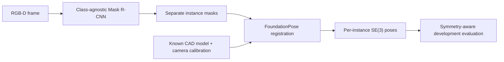

# PoseLoop

PoseLoop is an auditable RGB-D instance-to-6D-pose pipeline for crowded
industrial bin-picking scenes. A class-agnostic Mask R-CNN separates object
instances, FoundationPose estimates one 6D pose per predicted mask, and a
symmetry-aware evaluator checks the complete handoff.

[](https://github.com/Yanagisawa2002/PoseLoop/releases/tag/v1.1.0)
[](#evaluation-boundary)

[](docs/media/poseloop-demo.mp4)

**[Watch the 73-second result walkthrough](docs/media/poseloop-demo.mp4)** — raw
RGB, instance masks, FoundationPose CAD projections, and development GT for a
strong scene and the most clutter-sensitive scene.

## Result

The detector was evaluated on a fixed 25-frame, five-scene split containing
770 ground-truth instances. The frozen masks were then passed through
FoundationPose without changing its model, checkpoints, candidate count,
refinement count, or promotion thresholds.

| Stage | Metric | Result |
| --- | --- | ---: |
| Instance segmentation | Precision / recall / F1 at IoU 0.50 | 0.704 / 0.749 / **0.726** |
| Instance segmentation | AP50 / AP75 / PQ | **0.702** / 0.101 / **0.510** |
| End-to-end pose | Runtime completion | **820 / 820** |
| End-to-end pose | Joint precision / recall / F1 | 0.588 / 0.626 / **0.606** |
| End-to-end pose | Joint AP | **0.532** |
| End-to-end pose | Combined AR MSSD/MSPD | **0.638** |

The preceding generic proposal stack reached only 0.038 instance F1 on the
same evaluation. Replacing that stack with a true supervised instance detector
produced a paired mean frame-F1 gain of +0.699 with a 95% bootstrap interval of
[0.655, 0.737], positive on all 25 frames and all five scenes.

## Pipeline



The public entry point runs this exact inference path. It deliberately excludes
the retired exploratory branches and does not retune on the evaluation split.

## Run the frozen pipeline

The full path requires Ubuntu, an NVIDIA GPU, the pinned XYZ-IBD development
data, the frozen detector checkpoint, FoundationPose, and BOP Toolkit. External
data, model weights, and third-party source are never stored in this repository.

```bash
git clone https://github.com/Yanagisawa2002/PoseLoop.git
cd PoseLoop

# Check the two frozen contracts without a GPU.
python -B -m pose_accuracy_recovery_prep.real_instance_detector_v1 \
  protocol-check \
  --protocol protocols/poseloop_pose_accuracy_recovery_real_instance_detector_v1.json
python -B -m pose_accuracy_recovery_prep.a9_foundationpose_e2e contract-check

# Run detector inference -> FoundationPose -> evaluation -> evidence package.
bash scripts/run_release_pipeline.sh \
  --dataset-root /datasets/xyzibd \
  --detector-checkpoint /models/poseloop-maskrcnn.pt \
  --foundationpose-root /opt/FoundationPose \
  --toolkit-root /opt/bop_toolkit \
  --output-root /runs/poseloop-v1.1.0
```

The runner is fail-fast and create-only. It verifies the frozen detector
checkpoint, reconstructs the dataset manifest, records the exact Git identity,
executes all 820 pose registrations, evaluates only after primary inference is
complete, and emits a hashable evidence archive.

For a CPU-only check of the tracked release summary and media:

```bash
python -B scripts/verify_release.py
```

## Evaluation boundary

This is a positive result on already-consumed XYZ-IBD RealSense development
data. Training and evaluation scenes and object identities are disjoint, but
they come from the same corpus. The reported pose AP and AR are custom frozen
metrics, not official BOP leaderboard scores. This release is not sealed, does
not claim state of the art, and does not claim production real-time behavior.

Scene 10 is the strongest representative example. Scene 25 remains the hardest:
its end-to-end joint recall is 0.437, exposing misses and pose ambiguity among
thin, heavily occluded parts. AP75 of 0.101 also shows that high-IoU mask
boundaries remain substantially weaker than IoU50 instance recovery.

## Evidence and design choices

- [End-to-end result and immutable evidence identity](pose_accuracy_recovery_prep/a9_foundationpose_e2e/RESULT.md)
- [Detector result](pose_accuracy_recovery_prep/real_instance_detector_v1/DEVELOPMENT_RESULT.md)
- [Release result bundle](release/v1.1.0/results.json)
- [Retired hypotheses and negative results](docs/archived-negative-results.md)
- [Third-party licenses and dataset attribution](LICENSES.md)

The release keeps prediction-time labels, evaluator inputs, and official scorer
access at zero until primary inference is frozen. Runtime inputs, upstream
commits, checkpoints, protocols, output manifests, and evidence members are
SHA-256 bound. Long FoundationPose scoring is chunked to keep memory bounded,
and the primary runner supports exact resume without changing candidate
attention or scoring semantics.

## Repository map

- `pose_accuracy_recovery_prep/real_instance_detector_v1/` — detector training,
  inference, and evaluation.
- `pose_accuracy_recovery_prep/a9_foundationpose_e2e/` — frozen detector-to-pose
  handoff, primary execution, evaluation, and packaging.
- `foundationpose_runtime_prep/` — audited FoundationPose adapter and
  memory-bounded execution.
- `protocols/` — immutable experiment contracts.
- `release/v1.1.0/` — compact public result bundle.
- `docs/media/` — release video, poster, and attribution.

## License boundary

No project-level license is granted for PoseLoop's original source at this
time. The demo media is an adaptation of XYZ-IBD and is separately distributed
under CC BY-NC-SA 4.0; see [the media notice](docs/media/README.md). FoundationPose
source and checkpoints remain subject to NVIDIA's upstream terms. See
[LICENSES.md](LICENSES.md) before reproducing or redistributing any component.
