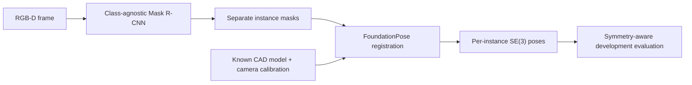

# PoseLoop

**RGB-D instance detection → FoundationPose 6D pose, with a frozen end-to-end evaluation path.**

PoseLoop targets crowded industrial bin-picking scenes where touching and occluded
parts make the detector-to-pose handoff the dominant failure mode. The supported
pipeline trains a class-agnostic instance detector, passes separate masks to
FoundationPose, and evaluates the complete chain with symmetry-aware pose criteria.

[](docs/media/poseloop-demo.mp4)

## Results at a glance

| Stage | Result | What changed |
| --- | ---: | --- |
| Instance segmentation F1 @ IoU 0.50 | **0.038 → 0.726** | Replaced the preceding generic proposal stack with a supervised class-agnostic Mask R-CNN |
| Instance segmentation AP50 / AP75 | **0.702 / 0.101** | Strong instance recovery at IoU50; high-IoU boundary quality remains a limitation |
| End-to-end joint pose F1 | **0.606** | Detection and pose correctness measured together |
| End-to-end joint pose AP | **0.532** | Frozen custom development metric |
| Combined AR MSSD/MSPD | **0.638** | Symmetry-aware pose diagnostic |
| Pose runtime completion | **820 / 820** | Every frozen detector prediction completed FoundationPose registration |

These measurements use a fixed XYZ-IBD RealSense development split: **25 frames,
five scenes, 770 ground-truth instances**. Training and evaluation scenes and object
identities are disjoint, but all data comes from the same already-consumed corpus.
The pose metrics are custom frozen metrics, not official BOP leaderboard scores.
This project does not claim state of the art or production real-time performance.

## Review this project in three minutes

1. [Watch the 73-second walkthrough](docs/media/poseloop-demo.mp4).
2. Read the [5090 reproduction](docs/REPRODUCTION_5090.md), [770-instance failure taxonomy](docs/FAILURE_TAXONOMY_RESULT.md), and [GPU profiling case](docs/GPU_PERFORMANCE_CASE.md): a measured batching experiment rejected after failing correctness.
3. Inspect the two supported implementation surfaces:
   - [`real_instance_detector_v1`](pose_accuracy_recovery_prep/real_instance_detector_v1/) — detector preparation, training, inference, and evaluation.
   - [`a9_foundationpose_e2e`](pose_accuracy_recovery_prep/a9_foundationpose_e2e/) — frozen mask-to-pose handoff, execution, evaluation, and evidence packaging.
4. Run the CPU-only tracked-evidence check: `python -B scripts/verify_portfolio.py`.

The detailed historical experiment tree is retained for replay and provenance. It is
**not** the recommended code-reading path; use [source navigation](docs/SOURCE_NAVIGATION.md)
when historical context is needed.

## Failure budget: where the current system still loses accuracy

The frozen v1.1.0 accounting is:

```text
770 ground-truth instances
  └─ 577 obtain a detector-mask match at IoU >= 0.50
       └─ 482 also pass the joint pose gate
```

That leaves **193 GT instances (25.1%)** without an IoU50 mask match and another
**95 instances (12.3% of GT; 16.5% of mask-matched GT)** that reach the pose stage
but fail the joint MSSD/MSPD pose criteria. This is intentionally not described as
193 pure detector misses: the upstream bucket also contains masks that fail the
IoU50 matching criterion. See the generated [failure waterfall](docs/failure-waterfall.md)
for the auditable derivation and per-scene recall. The subsequent replay completed
the [770-instance taxonomy](docs/FAILURE_TAXONOMY_RESULT.md): 1 detector miss,
114 boundary/IoU failures, 24 over-segmentation and 54 under-segmentation/merge
cases, plus 95 matched pose failures. These are diagnostic rule classifications.

AP75 of **0.101** and scene-25 joint recall of **0.4373** remain limitations.
The already-consumed evaluation split is not a new tuning target.

## Pipeline



## Engineering contribution

I implemented detector preparation/training/inference, the FoundationPose adapter and
resumable per-mask execution, symmetry-aware end-to-end evaluation, frozen experiment
contracts, failure analysis, and release/evidence packaging.

| Layer | Work in this repository | Upstream capability |
| --- | --- | --- |
| Instance detection | Dataset preparation, class-agnostic detector training/inference, mask handoff, evaluation | Mask R-CNN architecture and framework implementation |
| 6D pose | FoundationPose adapter, frozen inputs, bounded execution/resume, per-mask orchestration | FoundationPose pose model, checkpoints, registration/refinement algorithms |
| End-to-end evidence | Symmetry-aware evaluation, anti-leak execution boundary, failure accounting, release checks, reproducible result packaging | XYZ-IBD data, CAD models, BOP Toolkit utilities |

The contribution is the measured detector-to-pose system and its evaluation/runtime
engineering. PoseLoop does not claim authorship of FoundationPose or a new underlying
pose network.

## Reproduction status

The supported entry point is [`scripts/run_release_pipeline.sh`](scripts/run_release_pipeline.sh).
It is fail-fast and create-only: it verifies the frozen detector checkpoint, rebuilds
the dataset manifest, records exact Git identity, executes all 820 pose registrations,
evaluates only after primary inference is complete, and emits a hashable evidence
archive.

**Recovered and replayed on RTX 5090:** deterministic retraining recovered the
exact frozen checkpoint, detector outputs matched, and original A9 recorded
aggregate and per-scene metrics reproduced exactly. See the
[compact evidence and recovery commands](docs/REPRODUCTION_5090.md).
Historical per-instance A9 pose identity is not established. The checkpoint and
raw archives are backed up off-server but are not redistributed here; independent
GPU replay still requires pinned data, weights and dependencies. The runner
rejects a checkpoint whose SHA-256 differs from the frozen identity.

**Experimental development is frozen.** Further work is limited to bug fixes,
README/portfolio presentation or genuinely new external evaluation data.
The [GPU experiment](docs/GPU_PERFORMANCE_CASE.md) is complete: refine=64 was
rejected after numerical/evaluation equivalence failed. No Candidate #2 is planned.

The tracked release evidence can still be checked independently. Git LFS media must
be materialized rather than left as pointer files:

```bash
git lfs pull
python -B scripts/verify_portfolio.py
python -B scripts/verify_reproduction_5090.py
python -B scripts/build_failure_waterfall.py --check docs/failure-waterfall.md
```

A full GPU run additionally requires Ubuntu, an NVIDIA GPU, the pinned XYZ-IBD
development data, the exact detector checkpoint, FoundationPose, and BOP Toolkit:

```bash
bash scripts/run_release_pipeline.sh \
  --dataset-root /datasets/xyzibd \
  --detector-checkpoint /models/poseloop-maskrcnn.pt \
  --foundationpose-root /opt/FoundationPose \
  --toolkit-root /opt/bop_toolkit \
  --output-root /runs/poseloop-v1.1.0
```

The editable portfolio overview is separate from the frozen v1.1.0 README snapshot.
[`scripts/verify_portfolio.py`](scripts/verify_portfolio.py) maps frozen checksum
verification to that preserved snapshot and the unchanged release artifacts.

## Evidence

- [RTX 5090 recovery, reproducibility receipts and freeze policy](docs/REPRODUCTION_5090.md)
- [Completed failure taxonomy](docs/FAILURE_TAXONOMY_RESULT.md)
- [GPU performance case, resume bullets and interview preparation](docs/GPU_PERFORMANCE_CASE.md)
- [Detector development result](pose_accuracy_recovery_prep/real_instance_detector_v1/DEVELOPMENT_RESULT.md)
- [End-to-end FoundationPose result](pose_accuracy_recovery_prep/a9_foundationpose_e2e/RESULT.md)
- [Generated end-to-end failure waterfall](docs/failure-waterfall.md)
- [Compact v1.1.0 result bundle](release/v1.1.0/results.json)
- [Source navigation and dependency audit](docs/SOURCE_NAVIGATION.md)
- [Retired hypotheses and negative results](docs/archived-negative-results.md)
- [Third-party licenses and dataset attribution](LICENSES.md)

The release keeps prediction-time labels, evaluator inputs, official-scorer access and
scene-9 access at zero until primary inference is frozen. Runtime inputs, upstream
commits, checkpoints, protocols, output manifests, and evidence members are SHA-256
bound. Long FoundationPose scoring is chunked to keep memory bounded, and the primary
runner supports exact resume without changing candidate attention or scoring semantics.

## Repository map

- `pose_accuracy_recovery_prep/real_instance_detector_v1/` — supported detector path.
- `pose_accuracy_recovery_prep/a9_foundationpose_e2e/` — supported detector-to-pose path.
- `foundationpose_runtime_prep/` — audited FoundationPose runtime adaptation.
- `scripts/run_release_pipeline.sh` — supported release runner.
- `protocols/` — frozen experiment contracts.
- `release/v1.1.0/` — compact public result bundle and frozen snapshots.
- `docs/media/` — release video, poster, and attribution.
- historical `r3_*`, `r4a_*`, M1–M6 packages/scripts — retained for provenance and replay, not as public entry points.

<details>
<summary>Detailed evaluation numbers</summary>

| Stage | Metric | Result |
| --- | --- | ---: |
| Instance segmentation | Precision / recall / F1 at IoU 0.50 | 0.704 / 0.749 / **0.726** |
| Instance segmentation | AP50 / AP75 / PQ | **0.702** / 0.101 / **0.510** |
| End-to-end pose | Runtime completion | **820 / 820** |
| End-to-end pose | Joint precision / recall / F1 | 0.588 / 0.626 / **0.606** |
| End-to-end pose | Joint AP | **0.532** |
| End-to-end pose | Combined AR MSSD/MSPD | **0.638** |

The preceding generic proposal stack reached only 0.038 instance F1 on the same
evaluation. Replacing that stack with the supervised instance detector produced a
paired mean frame-F1 gain of +0.699 with a 95% bootstrap interval of
[0.655, 0.737], positive on all 25 frames and all five scenes.

Scene 10 is the strongest representative example. Scene 25 remains the hardest, with
joint recall 0.4373. Scene 40 also exposes reflective, overlapping-instance boundary
errors. These are development findings, not sealed-test or production claims.

</details>

## License boundary

No project-level license is currently granted for PoseLoop's original source. The demo
media is an adaptation of XYZ-IBD and is separately distributed under CC BY-NC-SA 4.0;
see [the media notice](docs/media/README.md). FoundationPose source and checkpoints
remain subject to NVIDIA's upstream terms. See [LICENSES.md](LICENSES.md) before
reproducing or redistributing any component.
