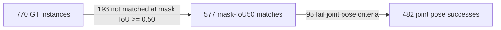

# PoseLoop v1.1.0 failure waterfall

This page is generated from `release/v1.1.0/results.json`. It does not introduce
new evaluation data or recompute model metrics; it exposes the frozen end-to-end
result as a stage-level failure budget.



| Stage | Count | Share of GT | Interpretation |
| --- | ---: | ---: | --- |
| Ground-truth instances | 770 | 100.0% | Fixed development evaluation population |
| Mask-IoU50 matches | 577 | 74.9% | Detection/instance-mask handoff reached the pose stage |
| Not matched at mask IoU >= 0.50 | 193 | 25.1% | Lost before the pose-correctness gate; this includes misses and masks that do not form an IoU50 match |
| Joint pose successes | 482 | 62.6% | Mask match plus normalized MSSD < 0.10 and MSPD < 10 px |
| Pose-stage losses after mask match | 95 | 12.3% | 16.5% of mask-matched GT instances fail the joint pose gate |

The detector emitted 820 predictions, including 243 IoU50 false positives
(29.6% of emitted predictions). Runtime completed all
820/820 frozen pose registrations.

## What this says about the next optimization

The largest absolute GT loss in v1.1.0 is still before joint pose scoring:
193 GT instances do not obtain a mask-IoU50 match, versus 95 additional
losses after a mask match exists. This does **not** prove every upstream loss is a
detector miss: the IoU50 bucket also contains boundary/instance-formation failures.
The detector AP75 is only 0.101, so high-IoU mask quality remains
a concrete diagnostic target. The next experiment should therefore separate outright
misses, over/under-segmentation, mask-boundary errors, and pose-registration failures
before changing either model family.

## Per-scene joint recall

| Scene | Joint recall |
| ---: | ---: |
| 10 | 0.8000 |
| 25 | 0.4373 |
| 30 | 0.7905 |
| 40 | 0.6148 |
| 65 | 0.7800 |

The weakest tracked scene is 25 at 0.4373 joint recall. Use it as a
failure-analysis slice, not as a new tuning target for the already-consumed frozen
evaluation split.

## Regenerate or check

```bash
python -B scripts/build_failure_waterfall.py --output docs/failure-waterfall.md
python -B scripts/build_failure_waterfall.py --check docs/failure-waterfall.md
```
