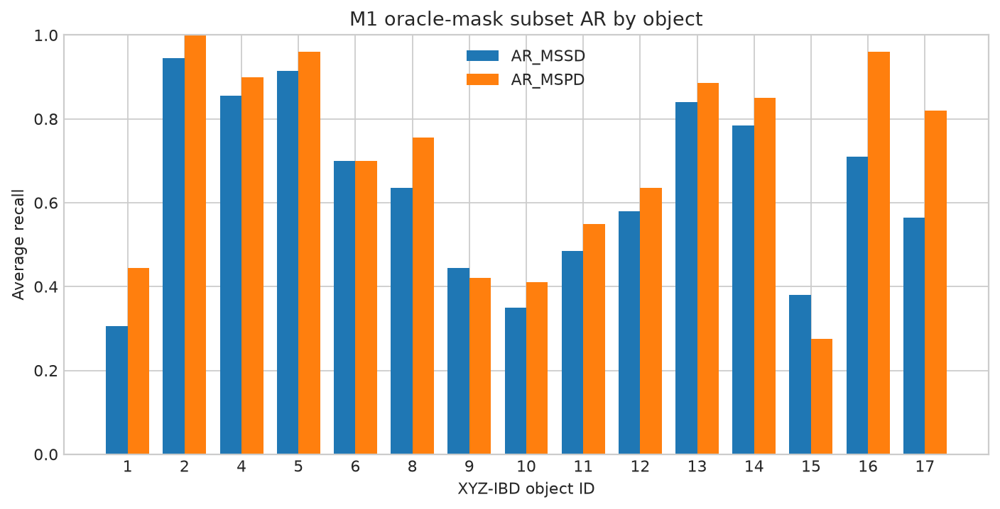
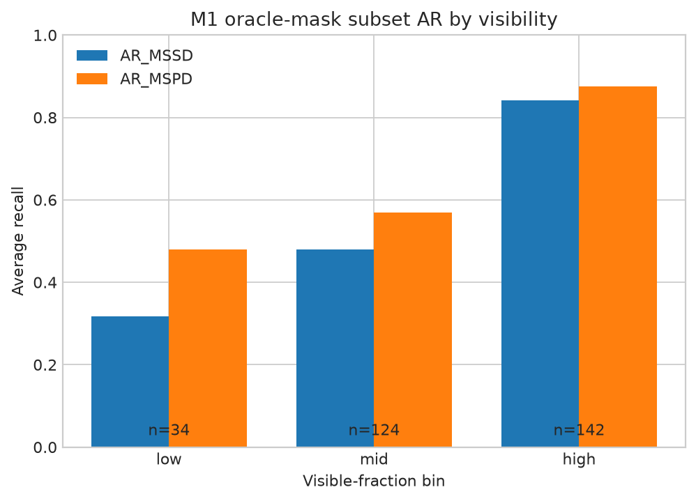
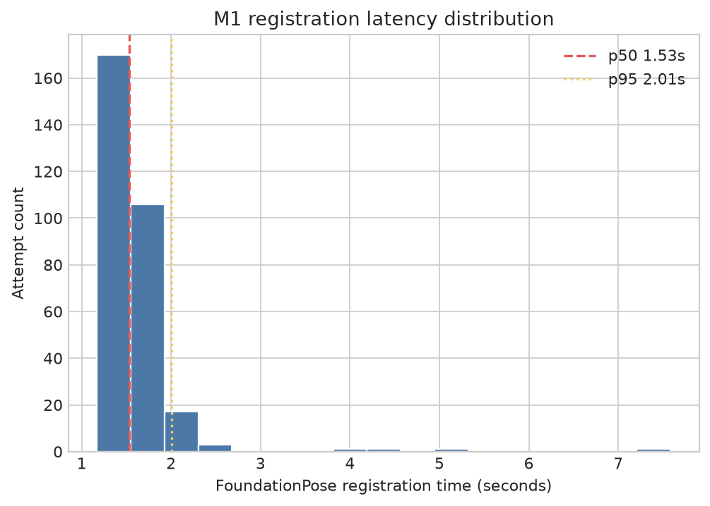

# PoseLoop M1 symmetry-aware single-view baseline

## Scope and caveats

- **Ground-truth visible masks and known object IDs are used.**
- **Only a deterministic 300-instance RealSense validation subset is evaluated.**
- **oracle_mask_subset_ar_mssd_mspd is not official BOP AP, leaderboard AR, or full-dataset performance.**
- **Raw rotation error is not symmetry-aware and is diagnostic only.**
- **These results are diagnostic evidence for choosing the next PoseLoop research module.**

## Overall diagnostic result

| Attempted | Finite poses | AR_MSSD | AR_MSPD | oracle_mask_subset_ar_mssd_mspd |
|---:|---:|---:|---:|---:|
| 300 | 300 (100.00%) | 63.30% | 70.43% | 66.87% |

Failures stay in the denominator and are misses at every threshold: 0 / 300 (0.00%). Statuses: `success` 300.

Runtime over 300 timed attempts: p50 1.530 s; p95 2.010 s. Successful-pose translation error: median 4.637 mm, p95 75.932 mm. Raw non-symmetry-aware rotation error: median 78.455 degrees, p95 179.327 degrees.

## M0 evaluator sanity

GT-vs-GT: MSSD 0.000000000 mm and MSPD 0.000000000 px. The M0 smoke prediction has raw rotation error 171.956 degrees, symmetry-aware MSSD 6.383 mm (0.0236 diameter), and symmetry-aware MSPD 3.459 px.

## Per-object result

| Object | n | Finite pose rate | AR_MSSD | AR_MSPD | Combined |
|---:|---:|---:|---:|---:|---:|
| 1 | 20 | 100.00% | 30.50% | 44.50% | 37.50% |
| 2 | 20 | 100.00% | 94.50% | 100.00% | 97.25% |
| 4 | 20 | 100.00% | 85.50% | 90.00% | 87.75% |
| 5 | 20 | 100.00% | 91.50% | 96.00% | 93.75% |
| 6 | 20 | 100.00% | 70.00% | 70.00% | 70.00% |
| 8 | 20 | 100.00% | 63.50% | 75.50% | 69.50% |
| 9 | 20 | 100.00% | 44.50% | 42.00% | 43.25% |
| 10 | 20 | 100.00% | 35.00% | 41.00% | 38.00% |
| 11 | 20 | 100.00% | 48.50% | 55.00% | 51.75% |
| 12 | 20 | 100.00% | 58.00% | 63.50% | 60.75% |
| 13 | 20 | 100.00% | 84.00% | 88.50% | 86.25% |
| 14 | 20 | 100.00% | 78.50% | 85.00% | 81.75% |
| 15 | 20 | 100.00% | 38.00% | 27.50% | 32.75% |
| 16 | 20 | 100.00% | 71.00% | 96.00% | 83.50% |
| 17 | 20 | 100.00% | 56.50% | 82.00% | 69.25% |

## Visibility and valid depth

| Visibility | n | Finite pose rate | AR_MSSD | AR_MSPD | Combined |
|---|---:|---:|---:|---:|---:|
| low | 34 | 100.00% | 31.76% | 47.94% | 39.85% |
| mid | 124 | 100.00% | 47.98% | 56.94% | 52.46% |
| high | 142 | 100.00% | 84.23% | 87.61% | 85.92% |

| Valid-depth ratio | n | Finite pose rate | AR_MSSD | AR_MSPD | Combined |
|---|---:|---:|---:|---:|---:|
| [0.00,0.90) | 8 | 100.00% | 47.50% | 61.25% | 54.37% |
| [0.90,0.99) | 68 | 100.00% | 63.24% | 69.71% | 66.47% |
| [0.99,1.00] | 224 | 100.00% | 63.88% | 70.98% | 67.43% |

## Runtime distribution

## Spearman diagnostics

Correlations use successful finite poses only; missing or constant scores are reported as unavailable. FoundationPose score fields are raw upstream scores, not calibrated confidence.

| Pair | n | rho | p-value |
|---|---:|---:|---:|
| visibility_vs_normalized_mssd | 300 | -0.501 | 0.000 |
| valid_depth_ratio_vs_normalized_mssd | 300 | 0.029 | 0.617 |
| foundationpose_top_score_vs_normalized_mssd | 300 | 0.322 | 0.000 |
| foundationpose_top_score_margin_vs_normalized_mssd | 300 | 0.228 | 0.000 |

## Reproducibility boundary

Official MSSD/MSPD calls use BOP Toolkit commit `cea62d651c7e395b2e1962b9749e4e89693c6ac4` in the separate `poseloop-bop` environment, `models_eval`, and `max_sym_disc_step = 0.01`. Thresholds are MSSD 0.05 through 0.50 object diameters and MSPD 5r through 50r pixels, with `r = image_width / 640`.
