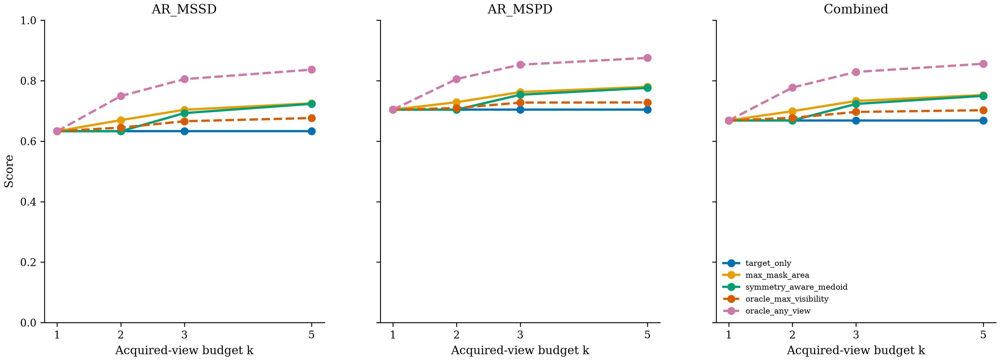
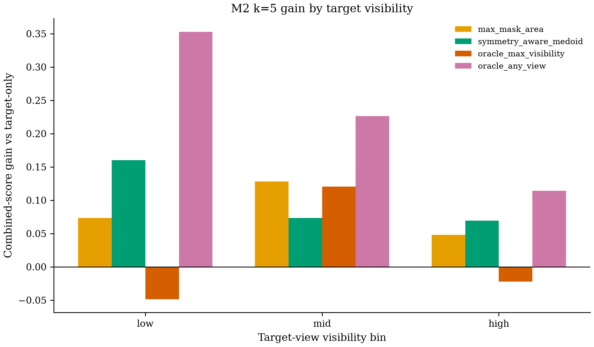
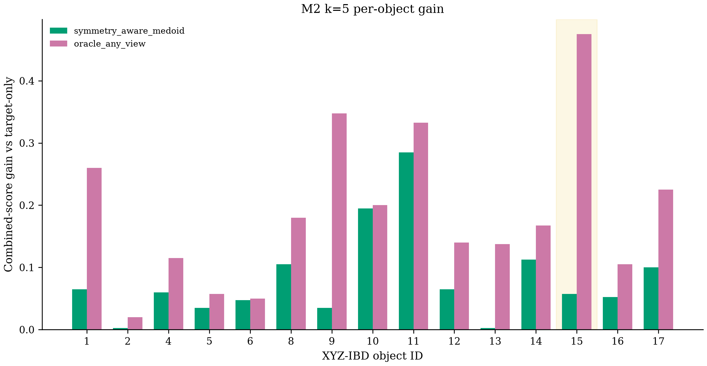
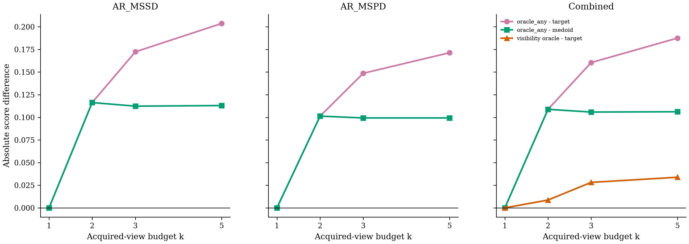

# PoseLoop M2 calibrated multi-view rescue diagnostic

## Answer first

At k=5, the fixed max-mask selector raises the combined diagnostic score from 66.87% to 75.27% (+8.40 pp), the main positive M2 result. It selects among acquired poses using ground-truth visible-mask area, so this is an oracle-mask diagnostic rather than a deployable policy or independent holdout result. The fixed symmetry-aware medoid also improves over target-only (+8.13 pp), while the threshold-specific any-view upper bound shows +18.75 pp of recoverable headroom.

The k=1 target-only combined score is
66.87%
(0.6686666667), exactly
reproducing M1 within `1e-12`.

## Scope and hard caveats

- **Known object IDs and ground-truth visible masks are used.**
- **Ground truth is used for oracle cross-view physical-instance association.**
- **The target set is exactly the same 300 RealSense target views used in M1.**
- **This oracle-mask subset is not a full BOP detection submission.**
- **oracle_max_visibility and oracle_any_view are non-deployable diagnostic upper bounds.**
- **These scores are not directly comparable to BOP Industrial detection AP.**

## Overall results

| k | Method | Finite/upper-bound usable | AR_MSSD | AR_MSPD | Combined | Mean usable views |
|---:|---|---:|---:|---:|---:|---:|
| 1 | `target_only` | 100.00% | 63.30% | 70.43% | 66.87% | 1.00 |
| 1 | `max_mask_area` | 100.00% | 63.30% | 70.43% | 66.87% | 1.00 |
| 1 | `symmetry_aware_medoid` | 100.00% | 63.30% | 70.43% | 66.87% | 1.00 |
| 1 | `oracle_max_visibility` | 100.00% | 63.30% | 70.43% | 66.87% | 1.00 |
| 1 | `oracle_any_view` | 100.00% | 63.30% | 70.43% | 66.87% | 1.00 |
| 2 | `target_only` | 100.00% | 63.30% | 70.43% | 66.87% | 2.00 |
| 2 | `max_mask_area` | 100.00% | 66.97% | 72.90% | 69.93% | 2.00 |
| 2 | `symmetry_aware_medoid` | 100.00% | 63.30% | 70.43% | 66.87% | 2.00 |
| 2 | `oracle_max_visibility` | 100.00% | 64.50% | 70.97% | 67.73% | 2.00 |
| 2 | `oracle_any_view` | 100.00% | 74.93% | 80.57% | 77.75% | 2.00 |
| 3 | `target_only` | 100.00% | 63.30% | 70.43% | 66.87% | 3.00 |
| 3 | `max_mask_area` | 100.00% | 70.40% | 76.23% | 73.32% | 3.00 |
| 3 | `symmetry_aware_medoid` | 100.00% | 69.30% | 75.37% | 72.33% | 3.00 |
| 3 | `oracle_max_visibility` | 100.00% | 66.60% | 72.77% | 69.68% | 3.00 |
| 3 | `oracle_any_view` | 100.00% | 80.53% | 85.30% | 82.92% | 3.00 |
| 5 | `target_only` | 100.00% | 63.30% | 70.43% | 66.87% | 5.00 |
| 5 | `max_mask_area` | 100.00% | 72.53% | 78.00% | 75.27% | 5.00 |
| 5 | `symmetry_aware_medoid` | 100.00% | 72.37% | 77.63% | 75.00% | 5.00 |
| 5 | `oracle_max_visibility` | 100.00% | 67.67% | 72.83% | 70.25% | 5.00 |
| 5 | `oracle_any_view` | 100.00% | 83.67% | 87.57% | 85.62% | 5.00 |

`oracle_any_view` is threshold-specific: its MSSD and MSPD successes may come
from different views, so it is not a selected or fused pose.

## Target visibility

Gain is relative to the matching target-visibility stratum at target-only
k=1.

| k | Method | Target visibility | n | Combined | Gain |
|---:|---|---|---:|---:|---:|
| 1 | `target_only` | low | 34 | 39.85% | 0.00% |
| 1 | `target_only` | mid | 124 | 52.46% | 0.00% |
| 1 | `target_only` | high | 142 | 85.92% | 0.00% |
| 1 | `max_mask_area` | low | 34 | 39.85% | 0.00% |
| 1 | `max_mask_area` | mid | 124 | 52.46% | 0.00% |
| 1 | `max_mask_area` | high | 142 | 85.92% | 0.00% |
| 1 | `symmetry_aware_medoid` | low | 34 | 39.85% | 0.00% |
| 1 | `symmetry_aware_medoid` | mid | 124 | 52.46% | 0.00% |
| 1 | `symmetry_aware_medoid` | high | 142 | 85.92% | 0.00% |
| 1 | `oracle_max_visibility` | low | 34 | 39.85% | 0.00% |
| 1 | `oracle_max_visibility` | mid | 124 | 52.46% | 0.00% |
| 1 | `oracle_max_visibility` | high | 142 | 85.92% | 0.00% |
| 1 | `oracle_any_view` | low | 34 | 39.85% | 0.00% |
| 1 | `oracle_any_view` | mid | 124 | 52.46% | 0.00% |
| 1 | `oracle_any_view` | high | 142 | 85.92% | 0.00% |
| 2 | `target_only` | low | 34 | 39.85% | 0.00% |
| 2 | `target_only` | mid | 124 | 52.46% | 0.00% |
| 2 | `target_only` | high | 142 | 85.92% | 0.00% |
| 2 | `max_mask_area` | low | 34 | 38.68% | -1.18% |
| 2 | `max_mask_area` | mid | 124 | 57.82% | +5.36% |
| 2 | `max_mask_area` | high | 142 | 87.99% | +2.08% |
| 2 | `symmetry_aware_medoid` | low | 34 | 39.85% | 0.00% |
| 2 | `symmetry_aware_medoid` | mid | 124 | 52.46% | 0.00% |
| 2 | `symmetry_aware_medoid` | high | 142 | 85.92% | 0.00% |
| 2 | `oracle_max_visibility` | low | 34 | 38.68% | -1.18% |
| 2 | `oracle_max_visibility` | mid | 124 | 55.04% | +2.58% |
| 2 | `oracle_max_visibility` | high | 142 | 85.77% | -0.14% |
| 2 | `oracle_any_view` | low | 34 | 60.00% | +20.15% |
| 2 | `oracle_any_view` | mid | 124 | 63.91% | +11.45% |
| 2 | `oracle_any_view` | high | 142 | 94.08% | +8.17% |
| 3 | `target_only` | low | 34 | 39.85% | 0.00% |
| 3 | `target_only` | mid | 124 | 52.46% | 0.00% |
| 3 | `target_only` | high | 142 | 85.92% | 0.00% |
| 3 | `max_mask_area` | low | 34 | 46.91% | +7.06% |
| 3 | `max_mask_area` | mid | 124 | 66.09% | +13.63% |
| 3 | `max_mask_area` | high | 142 | 85.95% | +0.04% |
| 3 | `symmetry_aware_medoid` | low | 34 | 44.71% | +4.85% |
| 3 | `symmetry_aware_medoid` | mid | 124 | 58.63% | +6.17% |
| 3 | `symmetry_aware_medoid` | high | 142 | 90.92% | +5.00% |
| 3 | `oracle_max_visibility` | low | 34 | 42.06% | +2.21% |
| 3 | `oracle_max_visibility` | mid | 124 | 61.81% | +9.35% |
| 3 | `oracle_max_visibility` | high | 142 | 83.17% | -2.75% |
| 3 | `oracle_any_view` | low | 34 | 65.59% | +25.74% |
| 3 | `oracle_any_view` | mid | 124 | 73.02% | +20.56% |
| 3 | `oracle_any_view` | high | 142 | 95.70% | +9.79% |
| 5 | `target_only` | low | 34 | 39.85% | 0.00% |
| 5 | `target_only` | mid | 124 | 52.46% | 0.00% |
| 5 | `target_only` | high | 142 | 85.92% | 0.00% |
| 5 | `max_mask_area` | low | 34 | 47.21% | +7.35% |
| 5 | `max_mask_area` | mid | 124 | 65.28% | +12.82% |
| 5 | `max_mask_area` | high | 142 | 90.70% | +4.79% |
| 5 | `symmetry_aware_medoid` | low | 34 | 55.88% | +16.03% |
| 5 | `symmetry_aware_medoid` | mid | 124 | 59.80% | +7.34% |
| 5 | `symmetry_aware_medoid` | high | 142 | 92.85% | +6.94% |
| 5 | `oracle_max_visibility` | low | 34 | 35.00% | -4.85% |
| 5 | `oracle_max_visibility` | mid | 124 | 64.52% | +12.06% |
| 5 | `oracle_max_visibility` | high | 142 | 83.70% | -2.22% |
| 5 | `oracle_any_view` | low | 34 | 75.15% | +35.29% |
| 5 | `oracle_any_view` | mid | 124 | 75.08% | +22.62% |
| 5 | `oracle_any_view` | high | 142 | 97.32% | +11.41% |

## Per-object results

Gain is relative to the same object's target-only k=1 result.

| k | Method | Object | AR_MSSD | AR_MSPD | Combined | Gain |
|---:|---|---:|---:|---:|---:|---:|
| 1 | `target_only` | 1 | 30.50% | 44.50% | 37.50% | 0.00% |
| 1 | `target_only` | 2 | 94.50% | 100.00% | 97.25% | 0.00% |
| 1 | `target_only` | 4 | 85.50% | 90.00% | 87.75% | 0.00% |
| 1 | `target_only` | 5 | 91.50% | 96.00% | 93.75% | 0.00% |
| 1 | `target_only` | 6 | 70.00% | 70.00% | 70.00% | 0.00% |
| 1 | `target_only` | 8 | 63.50% | 75.50% | 69.50% | 0.00% |
| 1 | `target_only` | 9 | 44.50% | 42.00% | 43.25% | 0.00% |
| 1 | `target_only` | 10 | 35.00% | 41.00% | 38.00% | 0.00% |
| 1 | `target_only` | 11 | 48.50% | 55.00% | 51.75% | 0.00% |
| 1 | `target_only` | 12 | 58.00% | 63.50% | 60.75% | 0.00% |
| 1 | `target_only` | 13 | 84.00% | 88.50% | 86.25% | 0.00% |
| 1 | `target_only` | 14 | 78.50% | 85.00% | 81.75% | 0.00% |
| 1 | `target_only` | 15 | 38.00% | 27.50% | 32.75% | 0.00% |
| 1 | `target_only` | 16 | 71.00% | 96.00% | 83.50% | 0.00% |
| 1 | `target_only` | 17 | 56.50% | 82.00% | 69.25% | 0.00% |
| 1 | `max_mask_area` | 1 | 30.50% | 44.50% | 37.50% | 0.00% |
| 1 | `max_mask_area` | 2 | 94.50% | 100.00% | 97.25% | 0.00% |
| 1 | `max_mask_area` | 4 | 85.50% | 90.00% | 87.75% | 0.00% |
| 1 | `max_mask_area` | 5 | 91.50% | 96.00% | 93.75% | 0.00% |
| 1 | `max_mask_area` | 6 | 70.00% | 70.00% | 70.00% | 0.00% |
| 1 | `max_mask_area` | 8 | 63.50% | 75.50% | 69.50% | 0.00% |
| 1 | `max_mask_area` | 9 | 44.50% | 42.00% | 43.25% | 0.00% |
| 1 | `max_mask_area` | 10 | 35.00% | 41.00% | 38.00% | 0.00% |
| 1 | `max_mask_area` | 11 | 48.50% | 55.00% | 51.75% | 0.00% |
| 1 | `max_mask_area` | 12 | 58.00% | 63.50% | 60.75% | 0.00% |
| 1 | `max_mask_area` | 13 | 84.00% | 88.50% | 86.25% | 0.00% |
| 1 | `max_mask_area` | 14 | 78.50% | 85.00% | 81.75% | 0.00% |
| 1 | `max_mask_area` | 15 | 38.00% | 27.50% | 32.75% | 0.00% |
| 1 | `max_mask_area` | 16 | 71.00% | 96.00% | 83.50% | 0.00% |
| 1 | `max_mask_area` | 17 | 56.50% | 82.00% | 69.25% | 0.00% |
| 1 | `symmetry_aware_medoid` | 1 | 30.50% | 44.50% | 37.50% | 0.00% |
| 1 | `symmetry_aware_medoid` | 2 | 94.50% | 100.00% | 97.25% | 0.00% |
| 1 | `symmetry_aware_medoid` | 4 | 85.50% | 90.00% | 87.75% | 0.00% |
| 1 | `symmetry_aware_medoid` | 5 | 91.50% | 96.00% | 93.75% | 0.00% |
| 1 | `symmetry_aware_medoid` | 6 | 70.00% | 70.00% | 70.00% | 0.00% |
| 1 | `symmetry_aware_medoid` | 8 | 63.50% | 75.50% | 69.50% | 0.00% |
| 1 | `symmetry_aware_medoid` | 9 | 44.50% | 42.00% | 43.25% | 0.00% |
| 1 | `symmetry_aware_medoid` | 10 | 35.00% | 41.00% | 38.00% | 0.00% |
| 1 | `symmetry_aware_medoid` | 11 | 48.50% | 55.00% | 51.75% | 0.00% |
| 1 | `symmetry_aware_medoid` | 12 | 58.00% | 63.50% | 60.75% | 0.00% |
| 1 | `symmetry_aware_medoid` | 13 | 84.00% | 88.50% | 86.25% | 0.00% |
| 1 | `symmetry_aware_medoid` | 14 | 78.50% | 85.00% | 81.75% | 0.00% |
| 1 | `symmetry_aware_medoid` | 15 | 38.00% | 27.50% | 32.75% | 0.00% |
| 1 | `symmetry_aware_medoid` | 16 | 71.00% | 96.00% | 83.50% | 0.00% |
| 1 | `symmetry_aware_medoid` | 17 | 56.50% | 82.00% | 69.25% | 0.00% |
| 1 | `oracle_max_visibility` | 1 | 30.50% | 44.50% | 37.50% | 0.00% |
| 1 | `oracle_max_visibility` | 2 | 94.50% | 100.00% | 97.25% | 0.00% |
| 1 | `oracle_max_visibility` | 4 | 85.50% | 90.00% | 87.75% | 0.00% |
| 1 | `oracle_max_visibility` | 5 | 91.50% | 96.00% | 93.75% | 0.00% |
| 1 | `oracle_max_visibility` | 6 | 70.00% | 70.00% | 70.00% | 0.00% |
| 1 | `oracle_max_visibility` | 8 | 63.50% | 75.50% | 69.50% | 0.00% |
| 1 | `oracle_max_visibility` | 9 | 44.50% | 42.00% | 43.25% | 0.00% |
| 1 | `oracle_max_visibility` | 10 | 35.00% | 41.00% | 38.00% | 0.00% |
| 1 | `oracle_max_visibility` | 11 | 48.50% | 55.00% | 51.75% | 0.00% |
| 1 | `oracle_max_visibility` | 12 | 58.00% | 63.50% | 60.75% | 0.00% |
| 1 | `oracle_max_visibility` | 13 | 84.00% | 88.50% | 86.25% | 0.00% |
| 1 | `oracle_max_visibility` | 14 | 78.50% | 85.00% | 81.75% | 0.00% |
| 1 | `oracle_max_visibility` | 15 | 38.00% | 27.50% | 32.75% | 0.00% |
| 1 | `oracle_max_visibility` | 16 | 71.00% | 96.00% | 83.50% | 0.00% |
| 1 | `oracle_max_visibility` | 17 | 56.50% | 82.00% | 69.25% | 0.00% |
| 1 | `oracle_any_view` | 1 | 30.50% | 44.50% | 37.50% | 0.00% |
| 1 | `oracle_any_view` | 2 | 94.50% | 100.00% | 97.25% | 0.00% |
| 1 | `oracle_any_view` | 4 | 85.50% | 90.00% | 87.75% | 0.00% |
| 1 | `oracle_any_view` | 5 | 91.50% | 96.00% | 93.75% | 0.00% |
| 1 | `oracle_any_view` | 6 | 70.00% | 70.00% | 70.00% | 0.00% |
| 1 | `oracle_any_view` | 8 | 63.50% | 75.50% | 69.50% | 0.00% |
| 1 | `oracle_any_view` | 9 | 44.50% | 42.00% | 43.25% | 0.00% |
| 1 | `oracle_any_view` | 10 | 35.00% | 41.00% | 38.00% | 0.00% |
| 1 | `oracle_any_view` | 11 | 48.50% | 55.00% | 51.75% | 0.00% |
| 1 | `oracle_any_view` | 12 | 58.00% | 63.50% | 60.75% | 0.00% |
| 1 | `oracle_any_view` | 13 | 84.00% | 88.50% | 86.25% | 0.00% |
| 1 | `oracle_any_view` | 14 | 78.50% | 85.00% | 81.75% | 0.00% |
| 1 | `oracle_any_view` | 15 | 38.00% | 27.50% | 32.75% | 0.00% |
| 1 | `oracle_any_view` | 16 | 71.00% | 96.00% | 83.50% | 0.00% |
| 1 | `oracle_any_view` | 17 | 56.50% | 82.00% | 69.25% | 0.00% |
| 2 | `target_only` | 1 | 30.50% | 44.50% | 37.50% | 0.00% |
| 2 | `target_only` | 2 | 94.50% | 100.00% | 97.25% | 0.00% |
| 2 | `target_only` | 4 | 85.50% | 90.00% | 87.75% | 0.00% |
| 2 | `target_only` | 5 | 91.50% | 96.00% | 93.75% | 0.00% |
| 2 | `target_only` | 6 | 70.00% | 70.00% | 70.00% | 0.00% |
| 2 | `target_only` | 8 | 63.50% | 75.50% | 69.50% | 0.00% |
| 2 | `target_only` | 9 | 44.50% | 42.00% | 43.25% | 0.00% |
| 2 | `target_only` | 10 | 35.00% | 41.00% | 38.00% | 0.00% |
| 2 | `target_only` | 11 | 48.50% | 55.00% | 51.75% | 0.00% |
| 2 | `target_only` | 12 | 58.00% | 63.50% | 60.75% | 0.00% |
| 2 | `target_only` | 13 | 84.00% | 88.50% | 86.25% | 0.00% |
| 2 | `target_only` | 14 | 78.50% | 85.00% | 81.75% | 0.00% |
| 2 | `target_only` | 15 | 38.00% | 27.50% | 32.75% | 0.00% |
| 2 | `target_only` | 16 | 71.00% | 96.00% | 83.50% | 0.00% |
| 2 | `target_only` | 17 | 56.50% | 82.00% | 69.25% | 0.00% |
| 2 | `max_mask_area` | 1 | 33.00% | 44.00% | 38.50% | +1.00% |
| 2 | `max_mask_area` | 2 | 93.50% | 100.00% | 96.75% | -0.50% |
| 2 | `max_mask_area` | 4 | 90.00% | 95.00% | 92.50% | +4.75% |
| 2 | `max_mask_area` | 5 | 92.50% | 96.50% | 94.50% | +0.75% |
| 2 | `max_mask_area` | 6 | 74.00% | 74.50% | 74.25% | +4.25% |
| 2 | `max_mask_area` | 8 | 78.00% | 85.00% | 81.50% | +12.00% |
| 2 | `max_mask_area` | 9 | 62.00% | 59.50% | 60.75% | +17.50% |
| 2 | `max_mask_area` | 10 | 42.00% | 50.00% | 46.00% | +8.00% |
| 2 | `max_mask_area` | 11 | 68.00% | 71.00% | 69.50% | +17.75% |
| 2 | `max_mask_area` | 12 | 40.00% | 39.50% | 39.75% | -21.00% |
| 2 | `max_mask_area` | 13 | 79.00% | 81.50% | 80.25% | -6.00% |
| 2 | `max_mask_area` | 14 | 88.50% | 95.00% | 91.75% | +10.00% |
| 2 | `max_mask_area` | 15 | 37.00% | 26.50% | 31.75% | -1.00% |
| 2 | `max_mask_area` | 16 | 65.50% | 97.00% | 81.25% | -2.25% |
| 2 | `max_mask_area` | 17 | 61.50% | 78.50% | 70.00% | +0.75% |
| 2 | `symmetry_aware_medoid` | 1 | 30.50% | 44.50% | 37.50% | 0.00% |
| 2 | `symmetry_aware_medoid` | 2 | 94.50% | 100.00% | 97.25% | 0.00% |
| 2 | `symmetry_aware_medoid` | 4 | 85.50% | 90.00% | 87.75% | 0.00% |
| 2 | `symmetry_aware_medoid` | 5 | 91.50% | 96.00% | 93.75% | 0.00% |
| 2 | `symmetry_aware_medoid` | 6 | 70.00% | 70.00% | 70.00% | 0.00% |
| 2 | `symmetry_aware_medoid` | 8 | 63.50% | 75.50% | 69.50% | 0.00% |
| 2 | `symmetry_aware_medoid` | 9 | 44.50% | 42.00% | 43.25% | 0.00% |
| 2 | `symmetry_aware_medoid` | 10 | 35.00% | 41.00% | 38.00% | 0.00% |
| 2 | `symmetry_aware_medoid` | 11 | 48.50% | 55.00% | 51.75% | 0.00% |
| 2 | `symmetry_aware_medoid` | 12 | 58.00% | 63.50% | 60.75% | 0.00% |
| 2 | `symmetry_aware_medoid` | 13 | 84.00% | 88.50% | 86.25% | 0.00% |
| 2 | `symmetry_aware_medoid` | 14 | 78.50% | 85.00% | 81.75% | 0.00% |
| 2 | `symmetry_aware_medoid` | 15 | 38.00% | 27.50% | 32.75% | 0.00% |
| 2 | `symmetry_aware_medoid` | 16 | 71.00% | 96.00% | 83.50% | 0.00% |
| 2 | `symmetry_aware_medoid` | 17 | 56.50% | 82.00% | 69.25% | 0.00% |
| 2 | `oracle_max_visibility` | 1 | 33.00% | 44.00% | 38.50% | +1.00% |
| 2 | `oracle_max_visibility` | 2 | 93.50% | 100.00% | 96.75% | -0.50% |
| 2 | `oracle_max_visibility` | 4 | 91.00% | 95.00% | 93.00% | +5.25% |
| 2 | `oracle_max_visibility` | 5 | 88.50% | 93.00% | 90.75% | -3.00% |
| 2 | `oracle_max_visibility` | 6 | 74.00% | 74.50% | 74.25% | +4.25% |
| 2 | `oracle_max_visibility` | 8 | 72.00% | 80.00% | 76.00% | +6.50% |
| 2 | `oracle_max_visibility` | 9 | 62.50% | 60.00% | 61.25% | +18.00% |
| 2 | `oracle_max_visibility` | 10 | 43.50% | 50.00% | 46.75% | +8.75% |
| 2 | `oracle_max_visibility` | 11 | 63.00% | 65.50% | 64.25% | +12.50% |
| 2 | `oracle_max_visibility` | 12 | 40.00% | 39.50% | 39.75% | -21.00% |
| 2 | `oracle_max_visibility` | 13 | 58.50% | 66.00% | 62.25% | -24.00% |
| 2 | `oracle_max_visibility` | 14 | 88.50% | 95.00% | 91.75% | +10.00% |
| 2 | `oracle_max_visibility` | 15 | 38.00% | 27.00% | 32.50% | -0.25% |
| 2 | `oracle_max_visibility` | 16 | 65.50% | 97.00% | 81.25% | -2.25% |
| 2 | `oracle_max_visibility` | 17 | 56.00% | 78.00% | 67.00% | -2.25% |
| 2 | `oracle_any_view` | 1 | 44.00% | 59.00% | 51.50% | +14.00% |
| 2 | `oracle_any_view` | 2 | 96.00% | 100.00% | 98.00% | +0.75% |
| 2 | `oracle_any_view` | 4 | 92.00% | 95.00% | 93.50% | +5.75% |
| 2 | `oracle_any_view` | 5 | 96.50% | 99.50% | 98.00% | +4.25% |
| 2 | `oracle_any_view` | 6 | 74.50% | 74.50% | 74.50% | +4.50% |
| 2 | `oracle_any_view` | 8 | 79.00% | 85.50% | 82.25% | +12.75% |
| 2 | `oracle_any_view` | 9 | 68.00% | 65.00% | 66.50% | +23.25% |
| 2 | `oracle_any_view` | 10 | 53.00% | 60.00% | 56.50% | +18.50% |
| 2 | `oracle_any_view` | 11 | 78.50% | 80.50% | 79.50% | +27.75% |
| 2 | `oracle_any_view` | 12 | 64.50% | 68.50% | 66.50% | +5.75% |
| 2 | `oracle_any_view` | 13 | 95.00% | 96.00% | 95.50% | +9.25% |
| 2 | `oracle_any_view` | 14 | 93.50% | 100.00% | 96.75% | +15.00% |
| 2 | `oracle_any_view` | 15 | 43.00% | 37.50% | 40.25% | +7.50% |
| 2 | `oracle_any_view` | 16 | 77.50% | 99.50% | 88.50% | +5.00% |
| 2 | `oracle_any_view` | 17 | 69.00% | 88.00% | 78.50% | +9.25% |
| 3 | `target_only` | 1 | 30.50% | 44.50% | 37.50% | 0.00% |
| 3 | `target_only` | 2 | 94.50% | 100.00% | 97.25% | 0.00% |
| 3 | `target_only` | 4 | 85.50% | 90.00% | 87.75% | 0.00% |
| 3 | `target_only` | 5 | 91.50% | 96.00% | 93.75% | 0.00% |
| 3 | `target_only` | 6 | 70.00% | 70.00% | 70.00% | 0.00% |
| 3 | `target_only` | 8 | 63.50% | 75.50% | 69.50% | 0.00% |
| 3 | `target_only` | 9 | 44.50% | 42.00% | 43.25% | 0.00% |
| 3 | `target_only` | 10 | 35.00% | 41.00% | 38.00% | 0.00% |
| 3 | `target_only` | 11 | 48.50% | 55.00% | 51.75% | 0.00% |
| 3 | `target_only` | 12 | 58.00% | 63.50% | 60.75% | 0.00% |
| 3 | `target_only` | 13 | 84.00% | 88.50% | 86.25% | 0.00% |
| 3 | `target_only` | 14 | 78.50% | 85.00% | 81.75% | 0.00% |
| 3 | `target_only` | 15 | 38.00% | 27.50% | 32.75% | 0.00% |
| 3 | `target_only` | 16 | 71.00% | 96.00% | 83.50% | 0.00% |
| 3 | `target_only` | 17 | 56.50% | 82.00% | 69.25% | 0.00% |
| 3 | `max_mask_area` | 1 | 24.00% | 35.00% | 29.50% | -8.00% |
| 3 | `max_mask_area` | 2 | 92.50% | 100.00% | 96.25% | -1.00% |
| 3 | `max_mask_area` | 4 | 94.00% | 100.00% | 97.00% | +9.25% |
| 3 | `max_mask_area` | 5 | 93.00% | 96.50% | 94.75% | +1.00% |
| 3 | `max_mask_area` | 6 | 74.00% | 74.50% | 74.25% | +4.25% |
| 3 | `max_mask_area` | 8 | 72.00% | 80.00% | 76.00% | +6.50% |
| 3 | `max_mask_area` | 9 | 66.00% | 64.00% | 65.00% | +21.75% |
| 3 | `max_mask_area` | 10 | 46.50% | 56.00% | 51.25% | +13.25% |
| 3 | `max_mask_area` | 11 | 73.00% | 75.50% | 74.25% | +22.50% |
| 3 | `max_mask_area` | 12 | 53.50% | 53.50% | 53.50% | -7.25% |
| 3 | `max_mask_area` | 13 | 83.50% | 87.50% | 85.50% | -0.75% |
| 3 | `max_mask_area` | 14 | 88.50% | 95.00% | 91.75% | +10.00% |
| 3 | `max_mask_area` | 15 | 66.00% | 52.50% | 59.25% | +26.50% |
| 3 | `max_mask_area` | 16 | 71.50% | 98.50% | 85.00% | +1.50% |
| 3 | `max_mask_area` | 17 | 58.00% | 75.00% | 66.50% | -2.75% |
| 3 | `symmetry_aware_medoid` | 1 | 39.50% | 50.00% | 44.75% | +7.25% |
| 3 | `symmetry_aware_medoid` | 2 | 95.00% | 100.00% | 97.50% | +0.25% |
| 3 | `symmetry_aware_medoid` | 4 | 86.00% | 90.00% | 88.00% | +0.25% |
| 3 | `symmetry_aware_medoid` | 5 | 94.50% | 100.00% | 97.25% | +3.50% |
| 3 | `symmetry_aware_medoid` | 6 | 69.50% | 70.00% | 69.75% | -0.25% |
| 3 | `symmetry_aware_medoid` | 8 | 74.50% | 85.50% | 80.00% | +10.50% |
| 3 | `symmetry_aware_medoid` | 9 | 58.50% | 56.00% | 57.25% | +14.00% |
| 3 | `symmetry_aware_medoid` | 10 | 44.00% | 51.00% | 47.50% | +9.50% |
| 3 | `symmetry_aware_medoid` | 11 | 64.00% | 67.50% | 65.75% | +14.00% |
| 3 | `symmetry_aware_medoid` | 12 | 63.00% | 67.00% | 65.00% | +4.25% |
| 3 | `symmetry_aware_medoid` | 13 | 85.00% | 88.00% | 86.50% | +0.25% |
| 3 | `symmetry_aware_medoid` | 14 | 89.50% | 95.00% | 92.25% | +10.50% |
| 3 | `symmetry_aware_medoid` | 15 | 37.50% | 32.50% | 35.00% | +2.25% |
| 3 | `symmetry_aware_medoid` | 16 | 76.50% | 99.00% | 87.75% | +4.25% |
| 3 | `symmetry_aware_medoid` | 17 | 62.50% | 79.00% | 70.75% | +1.50% |
| 3 | `oracle_max_visibility` | 1 | 32.50% | 44.50% | 38.50% | +1.00% |
| 3 | `oracle_max_visibility` | 2 | 94.00% | 100.00% | 97.00% | -0.25% |
| 3 | `oracle_max_visibility` | 4 | 90.00% | 95.00% | 92.50% | +4.75% |
| 3 | `oracle_max_visibility` | 5 | 90.50% | 95.00% | 92.75% | -1.00% |
| 3 | `oracle_max_visibility` | 6 | 74.00% | 74.50% | 74.25% | +4.25% |
| 3 | `oracle_max_visibility` | 8 | 67.50% | 75.50% | 71.50% | +2.00% |
| 3 | `oracle_max_visibility` | 9 | 66.00% | 64.00% | 65.00% | +21.75% |
| 3 | `oracle_max_visibility` | 10 | 44.00% | 50.50% | 47.25% | +9.25% |
| 3 | `oracle_max_visibility` | 11 | 61.00% | 64.00% | 62.50% | +10.75% |
| 3 | `oracle_max_visibility` | 12 | 41.50% | 39.50% | 40.50% | -20.25% |
| 3 | `oracle_max_visibility` | 13 | 69.00% | 76.50% | 72.75% | -13.50% |
| 3 | `oracle_max_visibility` | 14 | 88.50% | 95.00% | 91.75% | +10.00% |
| 3 | `oracle_max_visibility` | 15 | 58.50% | 44.50% | 51.50% | +18.75% |
| 3 | `oracle_max_visibility` | 16 | 70.50% | 98.50% | 84.50% | +1.00% |
| 3 | `oracle_max_visibility` | 17 | 51.50% | 74.50% | 63.00% | -6.25% |
| 3 | `oracle_any_view` | 1 | 49.00% | 64.50% | 56.75% | +19.25% |
| 3 | `oracle_any_view` | 2 | 97.50% | 100.00% | 98.75% | +1.50% |
| 3 | `oracle_any_view` | 4 | 98.00% | 100.00% | 99.00% | +11.25% |
| 3 | `oracle_any_view` | 5 | 98.00% | 100.00% | 99.00% | +5.25% |
| 3 | `oracle_any_view` | 6 | 74.50% | 74.50% | 74.50% | +4.50% |
| 3 | `oracle_any_view` | 8 | 83.50% | 90.50% | 87.00% | +17.50% |
| 3 | `oracle_any_view` | 9 | 73.50% | 72.50% | 73.00% | +29.75% |
| 3 | `oracle_any_view` | 10 | 53.50% | 61.50% | 57.50% | +19.50% |
| 3 | `oracle_any_view` | 11 | 78.50% | 80.50% | 79.50% | +27.75% |
| 3 | `oracle_any_view` | 12 | 72.00% | 74.00% | 73.00% | +12.25% |
| 3 | `oracle_any_view` | 13 | 100.00% | 100.00% | 100.00% | +13.75% |
| 3 | `oracle_any_view` | 14 | 95.50% | 100.00% | 97.75% | +16.00% |
| 3 | `oracle_any_view` | 15 | 75.50% | 64.00% | 69.75% | +37.00% |
| 3 | `oracle_any_view` | 16 | 84.00% | 100.00% | 92.00% | +8.50% |
| 3 | `oracle_any_view` | 17 | 75.00% | 97.50% | 86.25% | +17.00% |
| 5 | `target_only` | 1 | 30.50% | 44.50% | 37.50% | 0.00% |
| 5 | `target_only` | 2 | 94.50% | 100.00% | 97.25% | 0.00% |
| 5 | `target_only` | 4 | 85.50% | 90.00% | 87.75% | 0.00% |
| 5 | `target_only` | 5 | 91.50% | 96.00% | 93.75% | 0.00% |
| 5 | `target_only` | 6 | 70.00% | 70.00% | 70.00% | 0.00% |
| 5 | `target_only` | 8 | 63.50% | 75.50% | 69.50% | 0.00% |
| 5 | `target_only` | 9 | 44.50% | 42.00% | 43.25% | 0.00% |
| 5 | `target_only` | 10 | 35.00% | 41.00% | 38.00% | 0.00% |
| 5 | `target_only` | 11 | 48.50% | 55.00% | 51.75% | 0.00% |
| 5 | `target_only` | 12 | 58.00% | 63.50% | 60.75% | 0.00% |
| 5 | `target_only` | 13 | 84.00% | 88.50% | 86.25% | 0.00% |
| 5 | `target_only` | 14 | 78.50% | 85.00% | 81.75% | 0.00% |
| 5 | `target_only` | 15 | 38.00% | 27.50% | 32.75% | 0.00% |
| 5 | `target_only` | 16 | 71.00% | 96.00% | 83.50% | 0.00% |
| 5 | `target_only` | 17 | 56.50% | 82.00% | 69.25% | 0.00% |
| 5 | `max_mask_area` | 1 | 37.00% | 46.00% | 41.50% | +4.00% |
| 5 | `max_mask_area` | 2 | 93.00% | 100.00% | 96.50% | -0.75% |
| 5 | `max_mask_area` | 4 | 94.00% | 100.00% | 97.00% | +9.25% |
| 5 | `max_mask_area` | 5 | 91.00% | 95.00% | 93.00% | -0.75% |
| 5 | `max_mask_area` | 6 | 74.00% | 74.50% | 74.25% | +4.25% |
| 5 | `max_mask_area` | 8 | 77.50% | 86.00% | 81.75% | +12.25% |
| 5 | `max_mask_area` | 9 | 59.50% | 58.00% | 58.75% | +15.50% |
| 5 | `max_mask_area` | 10 | 52.00% | 60.50% | 56.25% | +18.25% |
| 5 | `max_mask_area` | 11 | 69.50% | 72.50% | 71.00% | +19.25% |
| 5 | `max_mask_area` | 12 | 58.00% | 58.00% | 58.00% | -2.75% |
| 5 | `max_mask_area` | 13 | 83.00% | 88.50% | 85.75% | -0.50% |
| 5 | `max_mask_area` | 14 | 88.00% | 95.00% | 91.50% | +9.75% |
| 5 | `max_mask_area` | 15 | 75.50% | 59.50% | 67.50% | +34.75% |
| 5 | `max_mask_area` | 16 | 73.00% | 98.00% | 85.50% | +2.00% |
| 5 | `max_mask_area` | 17 | 63.00% | 78.50% | 70.75% | +1.50% |
| 5 | `symmetry_aware_medoid` | 1 | 39.50% | 48.50% | 44.00% | +6.50% |
| 5 | `symmetry_aware_medoid` | 2 | 95.00% | 100.00% | 97.50% | +0.25% |
| 5 | `symmetry_aware_medoid` | 4 | 92.50% | 95.00% | 93.75% | +6.00% |
| 5 | `symmetry_aware_medoid` | 5 | 94.50% | 100.00% | 97.25% | +3.50% |
| 5 | `symmetry_aware_medoid` | 6 | 74.50% | 75.00% | 74.75% | +4.75% |
| 5 | `symmetry_aware_medoid` | 8 | 75.00% | 85.00% | 80.00% | +10.50% |
| 5 | `symmetry_aware_medoid` | 9 | 48.00% | 45.50% | 46.75% | +3.50% |
| 5 | `symmetry_aware_medoid` | 10 | 54.00% | 61.00% | 57.50% | +19.50% |
| 5 | `symmetry_aware_medoid` | 11 | 80.00% | 80.50% | 80.25% | +28.50% |
| 5 | `symmetry_aware_medoid` | 12 | 66.00% | 68.50% | 67.25% | +6.50% |
| 5 | `symmetry_aware_medoid` | 13 | 84.50% | 88.50% | 86.50% | +0.25% |
| 5 | `symmetry_aware_medoid` | 14 | 91.00% | 95.00% | 93.00% | +11.25% |
| 5 | `symmetry_aware_medoid` | 15 | 40.50% | 36.50% | 38.50% | +5.75% |
| 5 | `symmetry_aware_medoid` | 16 | 78.50% | 99.00% | 88.75% | +5.25% |
| 5 | `symmetry_aware_medoid` | 17 | 72.00% | 86.50% | 79.25% | +10.00% |
| 5 | `oracle_max_visibility` | 1 | 40.00% | 51.00% | 45.50% | +8.00% |
| 5 | `oracle_max_visibility` | 2 | 95.00% | 100.00% | 97.50% | +0.25% |
| 5 | `oracle_max_visibility` | 4 | 90.50% | 95.00% | 92.75% | +5.00% |
| 5 | `oracle_max_visibility` | 5 | 87.00% | 93.50% | 90.25% | -3.50% |
| 5 | `oracle_max_visibility` | 6 | 74.00% | 74.50% | 74.25% | +4.25% |
| 5 | `oracle_max_visibility` | 8 | 73.00% | 80.50% | 76.75% | +7.25% |
| 5 | `oracle_max_visibility` | 9 | 63.50% | 61.00% | 62.25% | +19.00% |
| 5 | `oracle_max_visibility` | 10 | 39.50% | 45.50% | 42.50% | +4.50% |
| 5 | `oracle_max_visibility` | 11 | 59.50% | 62.50% | 61.00% | +9.25% |
| 5 | `oracle_max_visibility` | 12 | 35.00% | 30.00% | 32.50% | -28.25% |
| 5 | `oracle_max_visibility` | 13 | 79.00% | 84.50% | 81.75% | -4.50% |
| 5 | `oracle_max_visibility` | 14 | 90.00% | 95.00% | 92.50% | +10.75% |
| 5 | `oracle_max_visibility` | 15 | 60.50% | 46.50% | 53.50% | +20.75% |
| 5 | `oracle_max_visibility` | 16 | 72.50% | 98.00% | 85.25% | +1.75% |
| 5 | `oracle_max_visibility` | 17 | 56.00% | 75.00% | 65.50% | -3.75% |
| 5 | `oracle_any_view` | 1 | 52.00% | 75.00% | 63.50% | +26.00% |
| 5 | `oracle_any_view` | 2 | 98.50% | 100.00% | 99.25% | +2.00% |
| 5 | `oracle_any_view` | 4 | 98.50% | 100.00% | 99.25% | +11.50% |
| 5 | `oracle_any_view` | 5 | 99.00% | 100.00% | 99.50% | +5.75% |
| 5 | `oracle_any_view` | 6 | 75.00% | 75.00% | 75.00% | +5.00% |
| 5 | `oracle_any_view` | 8 | 84.50% | 90.50% | 87.50% | +18.00% |
| 5 | `oracle_any_view` | 9 | 78.50% | 77.50% | 78.00% | +34.75% |
| 5 | `oracle_any_view` | 10 | 54.00% | 62.00% | 58.00% | +20.00% |
| 5 | `oracle_any_view` | 11 | 85.00% | 85.00% | 85.00% | +33.25% |
| 5 | `oracle_any_view` | 12 | 74.50% | 75.00% | 74.75% | +14.00% |
| 5 | `oracle_any_view` | 13 | 100.00% | 100.00% | 100.00% | +13.75% |
| 5 | `oracle_any_view` | 14 | 97.00% | 100.00% | 98.50% | +16.75% |
| 5 | `oracle_any_view` | 15 | 85.50% | 75.00% | 80.25% | +47.50% |
| 5 | `oracle_any_view` | 16 | 88.00% | 100.00% | 94.00% | +10.50% |
| 5 | `oracle_any_view` | 17 | 85.00% | 98.50% | 91.75% | +22.50% |

### Object 15

| k | Method | AR_MSSD | AR_MSPD | Combined | Gain |
|---:|---|---:|---:|---:|---:|
| 1 | `target_only` | 38.00% | 27.50% | 32.75% | 0.00% |
| 1 | `max_mask_area` | 38.00% | 27.50% | 32.75% | 0.00% |
| 1 | `symmetry_aware_medoid` | 38.00% | 27.50% | 32.75% | 0.00% |
| 1 | `oracle_max_visibility` | 38.00% | 27.50% | 32.75% | 0.00% |
| 1 | `oracle_any_view` | 38.00% | 27.50% | 32.75% | 0.00% |
| 2 | `target_only` | 38.00% | 27.50% | 32.75% | 0.00% |
| 2 | `max_mask_area` | 37.00% | 26.50% | 31.75% | -1.00% |
| 2 | `symmetry_aware_medoid` | 38.00% | 27.50% | 32.75% | 0.00% |
| 2 | `oracle_max_visibility` | 38.00% | 27.00% | 32.50% | -0.25% |
| 2 | `oracle_any_view` | 43.00% | 37.50% | 40.25% | +7.50% |
| 3 | `target_only` | 38.00% | 27.50% | 32.75% | 0.00% |
| 3 | `max_mask_area` | 66.00% | 52.50% | 59.25% | +26.50% |
| 3 | `symmetry_aware_medoid` | 37.50% | 32.50% | 35.00% | +2.25% |
| 3 | `oracle_max_visibility` | 58.50% | 44.50% | 51.50% | +18.75% |
| 3 | `oracle_any_view` | 75.50% | 64.00% | 69.75% | +37.00% |
| 5 | `target_only` | 38.00% | 27.50% | 32.75% | 0.00% |
| 5 | `max_mask_area` | 75.50% | 59.50% | 67.50% | +34.75% |
| 5 | `symmetry_aware_medoid` | 40.50% | 36.50% | 38.50% | +5.75% |
| 5 | `oracle_max_visibility` | 60.50% | 46.50% | 53.50% | +20.75% |
| 5 | `oracle_any_view` | 85.50% | 75.00% | 80.25% | +47.50% |

## Rescue and harm at 0.10d / 10r

These rescue/harm diagnostics use the requested inclusive `<=` comparison at
0.10d and 10r; the AR curves above preserve M1's strict `<` comparisons.
The primary joint result requires the selected pose to pass both thresholds.
For `oracle_any_view`, one constituent view must pass both; separate MSSD and
MSPD upper bounds may still come from different views.

| k | Method | Joint rescue | Joint harm | MSSD rescue / harm | MSPD rescue / harm |
|---:|---|---:|---:|---:|---:|
| 1 | `target_only` | 0/133 (0.00%) | 0/167 (0.00%) | 0.00% / 0.00% | 0.00% / 0.00% |
| 1 | `max_mask_area` | 0/133 (0.00%) | 0/167 (0.00%) | 0.00% / 0.00% | 0.00% / 0.00% |
| 1 | `symmetry_aware_medoid` | 0/133 (0.00%) | 0/167 (0.00%) | 0.00% / 0.00% | 0.00% / 0.00% |
| 1 | `oracle_max_visibility` | 0/133 (0.00%) | 0/167 (0.00%) | 0.00% / 0.00% | 0.00% / 0.00% |
| 1 | `oracle_any_view` | 0/133 (0.00%) | 0/167 (0.00%) | 0.00% / 0.00% | 0.00% / 0.00% |
| 2 | `target_only` | 0/133 (0.00%) | 0/167 (0.00%) | 0.00% / 0.00% | 0.00% / 0.00% |
| 2 | `max_mask_area` | 28/133 (21.05%) | 12/167 (7.19%) | 21.05% / 7.19% | 24.76% / 8.21% |
| 2 | `symmetry_aware_medoid` | 0/133 (0.00%) | 0/167 (0.00%) | 0.00% / 0.00% | 0.00% / 0.00% |
| 2 | `oracle_max_visibility` | 19/133 (14.29%) | 12/167 (7.19%) | 14.29% / 7.19% | 19.05% / 8.72% |
| 2 | `oracle_any_view` | 34/133 (25.56%) | 0/167 (0.00%) | 25.56% / 0.00% | 31.43% / 0.00% |
| 3 | `target_only` | 0/133 (0.00%) | 0/167 (0.00%) | 0.00% / 0.00% | 0.00% / 0.00% |
| 3 | `max_mask_area` | 33/133 (24.81%) | 15/167 (8.98%) | 24.81% / 8.98% | 29.52% / 7.69% |
| 3 | `symmetry_aware_medoid` | 29/133 (21.80%) | 9/167 (5.39%) | 21.80% / 5.39% | 23.81% / 4.62% |
| 3 | `oracle_max_visibility` | 24/133 (18.05%) | 18/167 (10.78%) | 18.05% / 10.78% | 24.76% / 10.77% |
| 3 | `oracle_any_view` | 48/133 (36.09%) | 0/167 (0.00%) | 36.09% / 0.00% | 42.86% / 0.00% |
| 5 | `target_only` | 0/133 (0.00%) | 0/167 (0.00%) | 0.00% / 0.00% | 0.00% / 0.00% |
| 5 | `max_mask_area` | 37/133 (27.82%) | 13/167 (7.78%) | 27.82% / 7.78% | 31.43% / 5.64% |
| 5 | `symmetry_aware_medoid` | 42/133 (31.58%) | 6/167 (3.59%) | 31.58% / 3.59% | 29.52% / 2.05% |
| 5 | `oracle_max_visibility` | 27/133 (20.30%) | 18/167 (10.78%) | 20.30% / 10.78% | 26.67% / 11.79% |
| 5 | `oracle_any_view` | 60/133 (45.11%) | 0/167 (0.00%) | 45.11% / 0.00% | 46.67% / 0.00% |

## Oracle headroom

| k | Headroom MSSD | Headroom MSPD | Headroom combined | Medoid gap MSSD | Medoid gap MSPD | Medoid gap combined | Visibility-oracle combined gain |
|---:|---:|---:|---:|---:|---:|---:|---:|
| 1 | 0.00% | 0.00% | 0.00% | 0.00% | 0.00% | 0.00% | 0.00% |
| 2 | +11.63% | +10.13% | +10.88% | 11.63% | 10.13% | 10.88% | +0.87% |
| 3 | +17.23% | +14.87% | +16.05% | 11.23% | 9.93% | 10.58% | +2.82% |
| 5 | +20.37% | +17.13% | +18.75% | 11.30% | 9.93% | 10.62% | +3.38% |

## View availability and sequential cost

All 300 target groups are retained. Total-view availability distribution:
`{'5': 300}`; additional-view
distribution: `{'4': 300}`.
Failed predictions remain in score denominators. Latency sums the empirically
recorded single-view registration times in acquisition order; rows with an
untimed attempt are excluded from complete-latency summaries.

| k | Mean acquired | Mean usable | Mean seconds/target | p50 | p95 | Marginal mean seconds/additional view | Added-view p50 / p95 | Added timing | Complete target timing |
|---:|---:|---:|---:|---:|---:|---:|---:|---:|---:|
| 1 | 1.00 | 1.00 | 1.556 | 1.530 | 2.010 | n/a | n/a / n/a | 0/0 | 300/300 |
| 2 | 2.00 | 2.00 | 2.925 | 2.823 | 3.505 | 1.369 | 1.321 / 1.642 | 300/300 | 300/300 |
| 3 | 3.00 | 3.00 | 4.351 | 4.220 | 5.110 | 1.427 | 1.324 / 1.644 | 300/300 | 300/300 |
| 5 | 5.00 | 5.00 | 7.127 | 7.033 | 8.204 | 1.388 | 1.331 / 1.645 | 600/600 | 300/300 |

## Calibration and transformation checks

Candidate poses use `T_w_m = inverse(T_c_w) @ T_c_m`, followed by
`T_target_c_m = T_target_c_w @ T_w_m`. Reapplying that path to the grouped GT
poses produced max normalized MSSD
0.00006524 and max MSPD
0.00593364 px over
1500 grouped views, passing the fixed
0.0005d /
0.01 px evaluation gate.

The official symmetry-aware evaluator uses BOP Toolkit commit
`cea62d651c7e395b2e1962b9749e4e89693c6ac4`, `models_eval`, and
`max_sym_disc_step = 0.01`. Camera-diversity
acquisition order is fixed in `groups.jsonl`; no final-set GT pose error or GT
visibility was used to order views. The medoid uses no target GT for selection.
