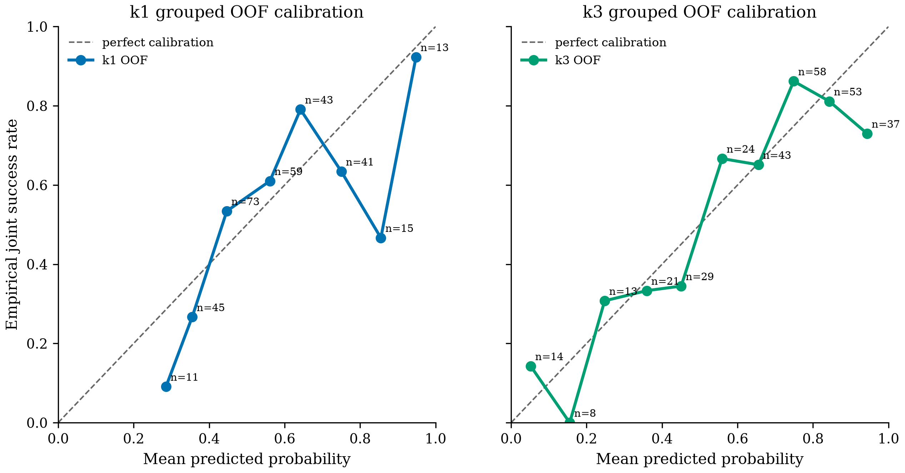
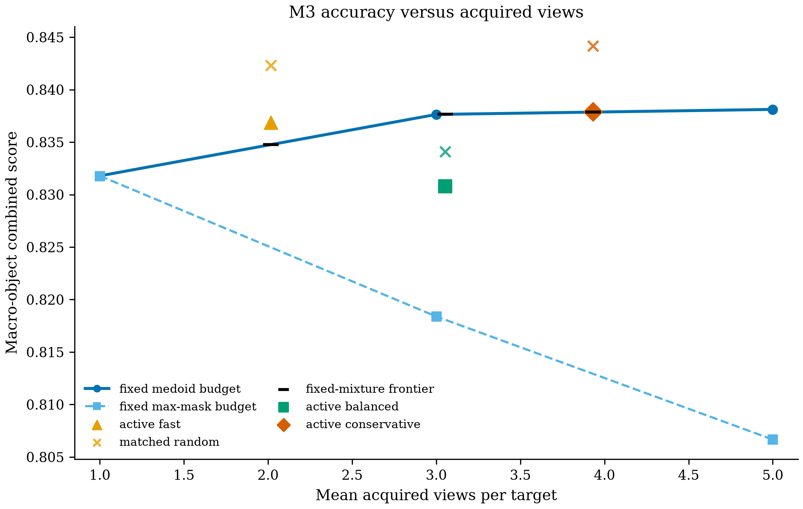
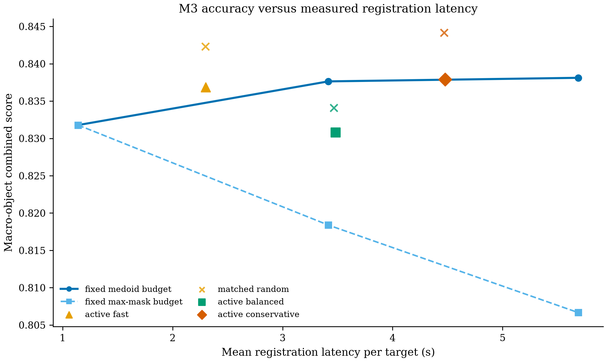
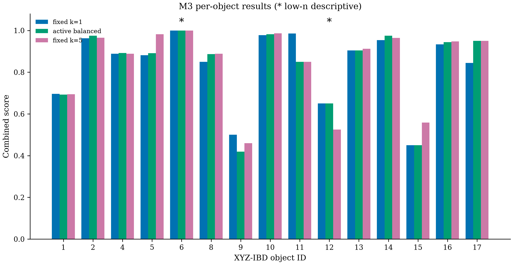

# PoseLoop M3 confidence-triggered active view budgeting

## Answer first

Fixed k=5 improves macro-object combined score only +0.63 pp over fixed k=1 (83.18% to 83.81%). Fast retains 80.09% of that gain at 2.02 views and 59.54% less registration latency; conservative retains 96.67% at 3.93 views. However, fast beats the fixed-mixture frontier by only +0.21 pp but trails matched random by 0.55 pp; balanced trails those controls by 0.69 pp and 0.33 pp, and conservative is +0.00 pp versus the mixture but trails random by 0.62 pp. Thus the frozen confidence models reduce budget while retaining near-k=5 accuracy at fast/conservative, but do not demonstrate a reliable allocation advantage over budget-matched controls on this holdout.

## Scope and hard caveats

- **Known object IDs and ground-truth visible masks are used.**
- **Ground truth is used for physical-instance association and final evaluation.**
- **Confidence features contain neither ground truth nor future-view information.**
- **All confidence models and thresholds were frozen on M2 before holdout evaluation.**
- **The holdout is physical-instance-disjoint from M2 but not scene-disjoint.**
- **Holdout object counts are unequal; macro-object metrics are primary.**
- **Per-object estimates with fewer than five targets are low-n descriptive results.**
- **Additional views use the fixed M2 geometry-based camera-diversity order.**
- **M3 adapts the view budget; it does not rank or learn next-best views.**
- **These oracle-mask subset diagnostics are not official BOP detection AP.**

The unequal holdout contains **230**
physical instances across all 15 objects, with development/holdout intersection
exactly `0`. Its per-object counts are
`{'1': 48, '2': 20, '4': 13, '5': 11, '6': 2, '8': 26, '9': 21, '10': 11, '11': 7, '12': 4, '13': 12, '14': 14, '15': 6, '16': 18, '17': 17}`. Target visibility-bin counts are
`{'high': 198, 'low': 0, 'mid': 32}`.

## Development confidence and immutable freeze

The grouped five-fold development split has zero physical-instance overlap in
every fold. M2-only out-of-fold diagnostics are:

The audited k=1 feature list is
`['mask_area_fraction', 'pose_usable_fraction', 'predicted_depth_m', 'predicted_translation_norm_m', 'predicted_lateral_offset_over_depth']`; the k=3 list is
`['mask_area_fraction_min', 'mask_area_fraction_median', 'mask_area_fraction_max', 'mask_area_fraction_std', 'pose_usable_fraction', 'predicted_depth_m', 'predicted_translation_norm_m', 'predicted_lateral_offset_over_depth', 'pairwise_norm_mssd_min', 'pairwise_norm_mssd_median', 'pairwise_norm_mssd_max', 'pairwise_norm_mssd_std', 'medoid_mean_norm_mssd']`. The audit
records zero GT feature inputs and zero future-view access.

| Stage | AUROC | AUPRC | Brier | ECE |
|---|---:|---:|---:|---:|
| k=1 | 0.6833 | 0.7053 | 0.2260 | 0.1090 |
| k=3 | 0.7438 | 0.7637 | 0.1881 | 0.0862 |

| Operating point | t1 | t3 | Development mean-view cap | Development macro combined | Development mean views |
|---|---:|---:|---:|---:|---:|
| fast | 0.50 | 0.05 | 2.0 | 70.18% | 1.887 |
| balanced | 0.65 | 0.50 | 3.0 | 73.22% | 2.953 |
| conservative | 0.95 | 0.70 | 4.0 | 74.95% | 3.967 |

Configuration hash: `a85ced7bb4fc2b66d08b43039eb018ab6d10a2554fc8fc50fb74f825573e5370`. It was frozen at
`2026-07-30T11:00:17.006724+00:00`, before the prediction stream was created
at `2026-07-30T11:01:00.552075+00:00`.

## Holdout fixed and active results

Macro-object scores are primary. Micro AR_MSSD, AR_MSPD, and combined are shown
only as secondary unequal-count summaries.

| Method | Macro AR_MSSD | Macro AR_MSPD | Macro combined | Micro AR_MSSD | Micro AR_MSPD | Micro combined | Views mean / p50 / p95 | Registration seconds mean / p50 / p95 |
|---|---:|---:|---:|---:|---:|---:|---:|---:|
| `fixed_k1_target` | 80.96% | 85.40% | 83.18% | 77.48% | 84.96% | 81.22% | 1.00 / 1.00 / 1.00 | 1.140 / 1.138 / 1.253 |
| `fixed_k3_medoid` | 82.29% | 85.24% | 83.76% | 79.61% | 84.87% | 82.24% | 3.00 / 3.00 / 3.00 | 3.416 / 3.417 / 3.758 |
| `fixed_k5_medoid` | 82.21% | 85.41% | 83.81% | 79.78% | 85.13% | 82.46% | 5.00 / 5.00 / 5.00 | 5.688 / 5.691 / 6.270 |
| `fixed_k3_max_mask` | 79.90% | 83.78% | 81.84% | 77.87% | 84.17% | 81.02% | 3.00 / 3.00 / 3.00 | 3.416 / 3.417 / 3.758 |
| `fixed_k5_max_mask` | 78.89% | 82.44% | 80.67% | 77.57% | 83.52% | 80.54% | 5.00 / 5.00 / 5.00 | 5.688 / 5.691 / 6.270 |
| `active_fast` | 81.93% | 85.44% | 83.69% | 78.91% | 84.96% | 81.93% | 2.02 / 2.00 / 3.00 | 2.301 / 2.190 / 3.754 |
| `active_balanced` | 81.68% | 84.48% | 83.08% | 79.00% | 84.22% | 81.61% | 3.05 / 3.00 / 5.00 | 3.481 / 3.430 / 5.798 |
| `active_conservative` | 82.26% | 85.32% | 83.79% | 79.83% | 85.04% | 82.43% | 3.93 / 3.00 / 5.00 | 4.477 / 3.747 / 6.218 |
| `random_fast` | 82.29% | 86.17% | 84.23% | 79.22% | 85.78% | 82.50% | 2.02 / 2.00 / 3.00 | 2.297 / 2.192 / 3.723 |
| `random_balanced` | 81.72% | 85.10% | 83.41% | 78.78% | 84.39% | 81.59% | 3.05 / 3.00 / 5.00 | 3.465 / 3.426 / 5.772 |
| `random_conservative` | 83.00% | 85.83% | 84.41% | 80.61% | 85.70% | 83.15% | 3.93 / 3.00 / 5.00 | 4.469 / 3.752 / 6.020 |
| `oracle_minimum_budget` | 83.36% | 86.91% | 85.14% | 81.17% | 86.96% | 84.07% | 1.98 / 1.00 / 5.00 | 2.249 / 1.163 / 5.687 |

`oracle_minimum_budget` uses the final GT joint diagnostic to stop at the first
successful medoid budget in k=1/k=3/k=5 order, falling back to k=5 when none
succeeds. It is therefore a diagnostic upper bound on perfect success-aware
stopping, not a deployable policy.

## Budget controls

Matched random assigns exactly the active policy's k=1/k=3/k=5 counts using a
fixed seed. The linear frontier is the best convex interpolation of the
stronger medoid or max-mask fixed selector at k=3 and k=5 (plus target-only
k=1) at the same mean view count.
Active policy overhead measures NumPy feature/model decisions plus the actually
timed symmetry-aware medoid selections required by the reached prefix; it
excludes registration, I/O, and report/evaluation aggregation.

| Policy | Macro combined | Mean views | Mean registration seconds | Mean policy overhead | Gain vs matched random (pp) | Mixture frontier | Gain vs frontier (pp) |
|---|---:|---:|---:|---:|---:|---:|---:|
| fast | 83.69% | 2.017 | 2.301 | 32.084 ms | -0.55 pp | 83.48% | +0.21 pp |
| balanced | 83.08% | 3.052 | 3.481 | 85.821 ms | -0.33 pp | 83.77% | -0.69 pp |
| conservative | 83.79% | 3.930 | 4.477 | 122.654 ms | -0.62 pp | 83.79% | +0.00 pp |

| Policy | Gain vs fixed k=1 (pp) | Active minus fixed k=3 (pp) | Active minus fixed k=5 (pp) | Fixed-k5 gain retained | Latency reduction vs fixed k=5 |
|---|---:|---:|---:|---:|---:|
| fast | +0.51 pp | -0.08 pp | -0.13 pp | 80.09% | 59.54% |
| balanced | -0.10 pp | -0.68 pp | -0.73 pp | -15.63% | 38.80% |
| conservative | +0.61 pp | +0.03 pp | -0.02 pp | 96.67% | 21.30% |

## Stopping, rescue, and harm

| Policy | Stop k=1 | Stop k=3 | Stop k=5 |
|---|---:|---:|---:|
| fast | 50.00% | 49.13% | 0.87% |
| balanced | 18.26% | 60.87% | 20.87% |
| conservative | 0.00% | 53.48% | 46.52% |

Joint rescue/harm uses the inclusive `<= 0.10d` and `<= 10r` diagnostic
thresholds and fixed k=1 as baseline.

| Policy | Joint rescue | Joint harm |
|---|---:|---:|
| fast | 14/66 (21.21%) | 7/164 (4.27%) |
| balanced | 16/66 (24.24%) | 7/164 (4.27%) |
| conservative | 18/66 (27.27%) | 5/164 (3.05%) |

## Visibility analysis

Target visibility is used only for post-hoc analysis. A missing stratum is
reported as `N/A`; no result is imputed.

| Policy | Visibility | n | Represented objects | Macro combined |
|---|---|---:|---:|---:|
| `fixed_k1_target` | low | 0 | 0 | N/A |
| `fixed_k1_target` | mid | 32 | 8 | 76.60% |
| `fixed_k1_target` | high | 198 | 15 | 83.52% |
| `fixed_k3_medoid` | low | 0 | 0 | N/A |
| `fixed_k3_medoid` | mid | 32 | 8 | 77.08% |
| `fixed_k3_medoid` | high | 198 | 15 | 84.35% |
| `fixed_k5_medoid` | low | 0 | 0 | N/A |
| `fixed_k5_medoid` | mid | 32 | 8 | 76.77% |
| `fixed_k5_medoid` | high | 198 | 15 | 84.42% |
| `fixed_k3_max_mask` | low | 0 | 0 | N/A |
| `fixed_k3_max_mask` | mid | 32 | 8 | 76.75% |
| `fixed_k3_max_mask` | high | 198 | 15 | 81.63% |
| `fixed_k5_max_mask` | low | 0 | 0 | N/A |
| `fixed_k5_max_mask` | mid | 32 | 8 | 59.25% |
| `fixed_k5_max_mask` | high | 198 | 15 | 82.65% |
| `active_fast` | low | 0 | 0 | N/A |
| `active_fast` | mid | 32 | 8 | 83.02% |
| `active_fast` | high | 198 | 15 | 83.60% |
| `active_balanced` | low | 0 | 0 | N/A |
| `active_balanced` | mid | 32 | 8 | 76.77% |
| `active_balanced` | high | 198 | 15 | 83.94% |
| `active_conservative` | low | 0 | 0 | N/A |
| `active_conservative` | mid | 32 | 8 | 76.77% |
| `active_conservative` | high | 198 | 15 | 84.40% |
| `random_fast` | low | 0 | 0 | N/A |
| `random_fast` | mid | 32 | 8 | 73.02% |
| `random_fast` | high | 198 | 15 | 85.25% |
| `random_balanced` | low | 0 | 0 | N/A |
| `random_balanced` | mid | 32 | 8 | 72.27% |
| `random_balanced` | high | 198 | 15 | 84.20% |
| `random_conservative` | low | 0 | 0 | N/A |
| `random_conservative` | mid | 32 | 8 | 77.08% |
| `random_conservative` | high | 198 | 15 | 85.06% |
| `oracle_minimum_budget` | low | 0 | 0 | N/A |
| `oracle_minimum_budget` | mid | 32 | 8 | 84.53% |
| `oracle_minimum_budget` | high | 198 | 15 | 84.63% |

## Per-object results

Rows with `n < 5` are explicitly low-n descriptive estimates.
Object 15 is included without special treatment.

| Object | n | Low-n | Fixed k=1 | Fast | Balanced | Conservative | Fixed k=5 |
|---:|---:|---|---:|---:|---:|---:|---:|
| 1 | 48 | no | 69.58% | 70.21% | 69.27% | 69.38% | 69.48% |
| 2 | 20 | no | 96.25% | 96.75% | 97.50% | 97.25% | 96.50% |
| 4 | 13 | no | 88.85% | 88.85% | 89.23% | 89.62% | 88.85% |
| 5 | 11 | no | 88.18% | 88.18% | 89.09% | 96.82% | 98.18% |
| 6 | 2 | yes | 100.00% | 100.00% | 100.00% | 100.00% | 100.00% |
| 8 | 26 | no | 85.00% | 88.85% | 88.65% | 88.65% | 88.85% |
| 9 | 21 | no | 50.00% | 48.33% | 41.90% | 45.71% | 45.95% |
| 10 | 11 | no | 97.73% | 97.73% | 98.18% | 98.64% | 98.64% |
| 11 | 7 | no | 98.57% | 99.29% | 85.00% | 85.00% | 85.00% |
| 12 | 4 | yes | 65.00% | 65.00% | 65.00% | 52.50% | 52.50% |
| 13 | 12 | no | 90.42% | 90.42% | 90.42% | 91.25% | 91.25% |
| 14 | 14 | no | 95.36% | 96.43% | 97.50% | 96.79% | 96.43% |
| 15 | 6 | no | 45.00% | 45.00% | 45.00% | 55.83% | 55.83% |
| 16 | 18 | no | 93.33% | 90.56% | 94.44% | 94.72% | 94.72% |
| 17 | 17 | no | 84.41% | 89.71% | 95.00% | 94.71% | 95.00% |

Object 15 has n=6: fixed k=1 45.00%, fast 45.00%, balanced 45.00%, conservative 55.83%, and fixed k=5 55.83%.

Complete per-object metric results:

| Method | Object | n | Low-n | AR_MSSD | AR_MSPD | Combined |
|---|---:|---:|---|---:|---:|---:|
| `fixed_k1_target` | 1 | 48 | no | 64.17% | 75.00% | 69.58% |
| `fixed_k1_target` | 2 | 20 | no | 92.50% | 100.00% | 96.25% |
| `fixed_k1_target` | 4 | 13 | no | 85.38% | 92.31% | 88.85% |
| `fixed_k1_target` | 5 | 11 | no | 84.55% | 91.82% | 88.18% |
| `fixed_k1_target` | 6 | 2 | yes | 100.00% | 100.00% | 100.00% |
| `fixed_k1_target` | 8 | 26 | no | 79.62% | 90.38% | 85.00% |
| `fixed_k1_target` | 9 | 21 | no | 50.48% | 49.52% | 50.00% |
| `fixed_k1_target` | 10 | 11 | no | 95.45% | 100.00% | 97.73% |
| `fixed_k1_target` | 11 | 7 | no | 97.14% | 100.00% | 98.57% |
| `fixed_k1_target` | 12 | 4 | yes | 67.50% | 62.50% | 65.00% |
| `fixed_k1_target` | 13 | 12 | no | 89.17% | 91.67% | 90.42% |
| `fixed_k1_target` | 14 | 14 | no | 91.43% | 99.29% | 95.36% |
| `fixed_k1_target` | 15 | 6 | no | 55.00% | 35.00% | 45.00% |
| `fixed_k1_target` | 16 | 18 | no | 86.67% | 100.00% | 93.33% |
| `fixed_k1_target` | 17 | 17 | no | 75.29% | 93.53% | 84.41% |
| `fixed_k3_medoid` | 1 | 48 | no | 64.17% | 72.29% | 68.23% |
| `fixed_k3_medoid` | 2 | 20 | no | 95.00% | 100.00% | 97.50% |
| `fixed_k3_medoid` | 4 | 13 | no | 86.92% | 92.31% | 89.62% |
| `fixed_k3_medoid` | 5 | 11 | no | 94.55% | 99.09% | 96.82% |
| `fixed_k3_medoid` | 6 | 2 | yes | 100.00% | 100.00% | 100.00% |
| `fixed_k3_medoid` | 8 | 26 | no | 85.00% | 92.69% | 88.85% |
| `fixed_k3_medoid` | 9 | 21 | no | 49.52% | 47.62% | 48.57% |
| `fixed_k3_medoid` | 10 | 11 | no | 97.27% | 100.00% | 98.64% |
| `fixed_k3_medoid` | 11 | 7 | no | 84.29% | 85.71% | 85.00% |
| `fixed_k3_medoid` | 12 | 4 | yes | 55.00% | 50.00% | 52.50% |
| `fixed_k3_medoid` | 13 | 12 | no | 90.83% | 91.67% | 91.25% |
| `fixed_k3_medoid` | 14 | 14 | no | 95.71% | 100.00% | 97.86% |
| `fixed_k3_medoid` | 15 | 6 | no | 63.33% | 50.00% | 56.67% |
| `fixed_k3_medoid` | 16 | 18 | no | 83.89% | 97.22% | 90.56% |
| `fixed_k3_medoid` | 17 | 17 | no | 88.82% | 100.00% | 94.41% |
| `fixed_k5_medoid` | 1 | 48 | no | 65.83% | 73.12% | 69.48% |
| `fixed_k5_medoid` | 2 | 20 | no | 93.00% | 100.00% | 96.50% |
| `fixed_k5_medoid` | 4 | 13 | no | 85.38% | 92.31% | 88.85% |
| `fixed_k5_medoid` | 5 | 11 | no | 96.36% | 100.00% | 98.18% |
| `fixed_k5_medoid` | 6 | 2 | yes | 100.00% | 100.00% | 100.00% |
| `fixed_k5_medoid` | 8 | 26 | no | 85.00% | 92.69% | 88.85% |
| `fixed_k5_medoid` | 9 | 21 | no | 46.19% | 45.71% | 45.95% |
| `fixed_k5_medoid` | 10 | 11 | no | 97.27% | 100.00% | 98.64% |
| `fixed_k5_medoid` | 11 | 7 | no | 84.29% | 85.71% | 85.00% |
| `fixed_k5_medoid` | 12 | 4 | yes | 55.00% | 50.00% | 52.50% |
| `fixed_k5_medoid` | 13 | 12 | no | 90.83% | 91.67% | 91.25% |
| `fixed_k5_medoid` | 14 | 14 | no | 92.86% | 100.00% | 96.43% |
| `fixed_k5_medoid` | 15 | 6 | no | 61.67% | 50.00% | 55.83% |
| `fixed_k5_medoid` | 16 | 18 | no | 89.44% | 100.00% | 94.72% |
| `fixed_k5_medoid` | 17 | 17 | no | 90.00% | 100.00% | 95.00% |
| `fixed_k3_max_mask` | 1 | 48 | no | 65.00% | 74.38% | 69.69% |
| `fixed_k3_max_mask` | 2 | 20 | no | 93.00% | 100.00% | 96.50% |
| `fixed_k3_max_mask` | 4 | 13 | no | 88.46% | 92.31% | 90.38% |
| `fixed_k3_max_mask` | 5 | 11 | no | 93.64% | 100.00% | 96.82% |
| `fixed_k3_max_mask` | 6 | 2 | yes | 95.00% | 100.00% | 97.50% |
| `fixed_k3_max_mask` | 8 | 26 | no | 83.85% | 92.69% | 88.27% |
| `fixed_k3_max_mask` | 9 | 21 | no | 48.10% | 46.19% | 47.14% |
| `fixed_k3_max_mask` | 10 | 11 | no | 96.36% | 100.00% | 98.18% |
| `fixed_k3_max_mask` | 11 | 7 | no | 57.14% | 58.57% | 57.86% |
| `fixed_k3_max_mask` | 12 | 4 | yes | 55.00% | 50.00% | 52.50% |
| `fixed_k3_max_mask` | 13 | 12 | no | 90.83% | 91.67% | 91.25% |
| `fixed_k3_max_mask` | 14 | 14 | no | 93.57% | 99.29% | 96.43% |
| `fixed_k3_max_mask` | 15 | 6 | no | 76.67% | 60.00% | 68.33% |
| `fixed_k3_max_mask` | 16 | 18 | no | 77.78% | 93.33% | 85.56% |
| `fixed_k3_max_mask` | 17 | 17 | no | 84.12% | 98.24% | 91.18% |
| `fixed_k5_max_mask` | 1 | 48 | no | 62.08% | 70.21% | 66.15% |
| `fixed_k5_max_mask` | 2 | 20 | no | 92.50% | 100.00% | 96.25% |
| `fixed_k5_max_mask` | 4 | 13 | no | 95.38% | 100.00% | 97.69% |
| `fixed_k5_max_mask` | 5 | 11 | no | 93.64% | 99.09% | 96.36% |
| `fixed_k5_max_mask` | 6 | 2 | yes | 95.00% | 100.00% | 97.50% |
| `fixed_k5_max_mask` | 8 | 26 | no | 82.31% | 90.38% | 86.35% |
| `fixed_k5_max_mask` | 9 | 21 | no | 51.43% | 50.48% | 50.95% |
| `fixed_k5_max_mask` | 10 | 11 | no | 96.36% | 100.00% | 98.18% |
| `fixed_k5_max_mask` | 11 | 7 | no | 57.14% | 58.57% | 57.86% |
| `fixed_k5_max_mask` | 12 | 4 | yes | 32.50% | 25.00% | 28.75% |
| `fixed_k5_max_mask` | 13 | 12 | no | 90.83% | 91.67% | 91.25% |
| `fixed_k5_max_mask` | 14 | 14 | no | 92.14% | 100.00% | 96.07% |
| `fixed_k5_max_mask` | 15 | 6 | no | 76.67% | 58.33% | 67.50% |
| `fixed_k5_max_mask` | 16 | 18 | no | 89.44% | 100.00% | 94.72% |
| `fixed_k5_max_mask` | 17 | 17 | no | 75.88% | 92.94% | 84.41% |
| `active_fast` | 1 | 48 | no | 66.04% | 74.38% | 70.21% |
| `active_fast` | 2 | 20 | no | 93.50% | 100.00% | 96.75% |
| `active_fast` | 4 | 13 | no | 85.38% | 92.31% | 88.85% |
| `active_fast` | 5 | 11 | no | 84.55% | 91.82% | 88.18% |
| `active_fast` | 6 | 2 | yes | 100.00% | 100.00% | 100.00% |
| `active_fast` | 8 | 26 | no | 85.00% | 92.69% | 88.85% |
| `active_fast` | 9 | 21 | no | 49.05% | 47.62% | 48.33% |
| `active_fast` | 10 | 11 | no | 95.45% | 100.00% | 97.73% |
| `active_fast` | 11 | 7 | no | 98.57% | 100.00% | 99.29% |
| `active_fast` | 12 | 4 | yes | 67.50% | 62.50% | 65.00% |
| `active_fast` | 13 | 12 | no | 89.17% | 91.67% | 90.42% |
| `active_fast` | 14 | 14 | no | 92.86% | 100.00% | 96.43% |
| `active_fast` | 15 | 6 | no | 55.00% | 35.00% | 45.00% |
| `active_fast` | 16 | 18 | no | 83.89% | 97.22% | 90.56% |
| `active_fast` | 17 | 17 | no | 82.94% | 96.47% | 89.71% |
| `active_balanced` | 1 | 48 | no | 65.42% | 73.12% | 69.27% |
| `active_balanced` | 2 | 20 | no | 95.00% | 100.00% | 97.50% |
| `active_balanced` | 4 | 13 | no | 86.15% | 92.31% | 89.23% |
| `active_balanced` | 5 | 11 | no | 85.45% | 92.73% | 89.09% |
| `active_balanced` | 6 | 2 | yes | 100.00% | 100.00% | 100.00% |
| `active_balanced` | 8 | 26 | no | 84.62% | 92.69% | 88.65% |
| `active_balanced` | 9 | 21 | no | 42.38% | 41.43% | 41.90% |
| `active_balanced` | 10 | 11 | no | 96.36% | 100.00% | 98.18% |
| `active_balanced` | 11 | 7 | no | 84.29% | 85.71% | 85.00% |
| `active_balanced` | 12 | 4 | yes | 67.50% | 62.50% | 65.00% |
| `active_balanced` | 13 | 12 | no | 89.17% | 91.67% | 90.42% |
| `active_balanced` | 14 | 14 | no | 95.00% | 100.00% | 97.50% |
| `active_balanced` | 15 | 6 | no | 55.00% | 35.00% | 45.00% |
| `active_balanced` | 16 | 18 | no | 88.89% | 100.00% | 94.44% |
| `active_balanced` | 17 | 17 | no | 90.00% | 100.00% | 95.00% |
| `active_conservative` | 1 | 48 | no | 65.63% | 73.12% | 69.38% |
| `active_conservative` | 2 | 20 | no | 94.50% | 100.00% | 97.25% |
| `active_conservative` | 4 | 13 | no | 86.92% | 92.31% | 89.62% |
| `active_conservative` | 5 | 11 | no | 94.55% | 99.09% | 96.82% |
| `active_conservative` | 6 | 2 | yes | 100.00% | 100.00% | 100.00% |
| `active_conservative` | 8 | 26 | no | 84.62% | 92.69% | 88.65% |
| `active_conservative` | 9 | 21 | no | 46.19% | 45.24% | 45.71% |
| `active_conservative` | 10 | 11 | no | 97.27% | 100.00% | 98.64% |
| `active_conservative` | 11 | 7 | no | 84.29% | 85.71% | 85.00% |
| `active_conservative` | 12 | 4 | yes | 55.00% | 50.00% | 52.50% |
| `active_conservative` | 13 | 12 | no | 90.83% | 91.67% | 91.25% |
| `active_conservative` | 14 | 14 | no | 93.57% | 100.00% | 96.79% |
| `active_conservative` | 15 | 6 | no | 61.67% | 50.00% | 55.83% |
| `active_conservative` | 16 | 18 | no | 89.44% | 100.00% | 94.72% |
| `active_conservative` | 17 | 17 | no | 89.41% | 100.00% | 94.71% |
| `random_fast` | 1 | 48 | no | 65.83% | 75.83% | 70.83% |
| `random_fast` | 2 | 20 | no | 93.00% | 100.00% | 96.50% |
| `random_fast` | 4 | 13 | no | 86.15% | 92.31% | 89.23% |
| `random_fast` | 5 | 11 | no | 93.64% | 98.18% | 95.91% |
| `random_fast` | 6 | 2 | yes | 100.00% | 100.00% | 100.00% |
| `random_fast` | 8 | 26 | no | 83.85% | 92.69% | 88.27% |
| `random_fast` | 9 | 21 | no | 54.29% | 52.38% | 53.33% |
| `random_fast` | 10 | 11 | no | 97.27% | 100.00% | 98.64% |
| `random_fast` | 11 | 7 | no | 84.29% | 85.71% | 85.00% |
| `random_fast` | 12 | 4 | yes | 67.50% | 62.50% | 65.00% |
| `random_fast` | 13 | 12 | no | 90.00% | 91.67% | 90.83% |
| `random_fast` | 14 | 14 | no | 93.57% | 100.00% | 96.79% |
| `random_fast` | 15 | 6 | no | 63.33% | 50.00% | 56.67% |
| `random_fast` | 16 | 18 | no | 82.22% | 97.22% | 89.72% |
| `random_fast` | 17 | 17 | no | 79.41% | 94.12% | 86.76% |
| `random_balanced` | 1 | 48 | no | 62.08% | 70.21% | 66.15% |
| `random_balanced` | 2 | 20 | no | 94.50% | 100.00% | 97.25% |
| `random_balanced` | 4 | 13 | no | 86.15% | 92.31% | 89.23% |
| `random_balanced` | 5 | 11 | no | 94.55% | 99.09% | 96.82% |
| `random_balanced` | 6 | 2 | yes | 100.00% | 100.00% | 100.00% |
| `random_balanced` | 8 | 26 | no | 84.23% | 92.69% | 88.46% |
| `random_balanced` | 9 | 21 | no | 45.71% | 44.76% | 45.24% |
| `random_balanced` | 10 | 11 | no | 96.36% | 100.00% | 98.18% |
| `random_balanced` | 11 | 7 | no | 84.29% | 85.71% | 85.00% |
| `random_balanced` | 12 | 4 | yes | 55.00% | 50.00% | 52.50% |
| `random_balanced` | 13 | 12 | no | 90.00% | 91.67% | 90.83% |
| `random_balanced` | 14 | 14 | no | 93.57% | 100.00% | 96.79% |
| `random_balanced` | 15 | 6 | no | 61.67% | 50.00% | 55.83% |
| `random_balanced` | 16 | 18 | no | 88.89% | 100.00% | 94.44% |
| `random_balanced` | 17 | 17 | no | 88.82% | 100.00% | 94.41% |
| `random_conservative` | 1 | 48 | no | 65.00% | 73.12% | 69.06% |
| `random_conservative` | 2 | 20 | no | 94.00% | 100.00% | 97.00% |
| `random_conservative` | 4 | 13 | no | 86.92% | 92.31% | 89.62% |
| `random_conservative` | 5 | 11 | no | 96.36% | 100.00% | 98.18% |
| `random_conservative` | 6 | 2 | yes | 100.00% | 100.00% | 100.00% |
| `random_conservative` | 8 | 26 | no | 85.77% | 92.69% | 89.23% |
| `random_conservative` | 9 | 21 | no | 53.33% | 51.90% | 52.62% |
| `random_conservative` | 10 | 11 | no | 96.36% | 100.00% | 98.18% |
| `random_conservative` | 11 | 7 | no | 84.29% | 85.71% | 85.00% |
| `random_conservative` | 12 | 4 | yes | 55.00% | 50.00% | 52.50% |
| `random_conservative` | 13 | 12 | no | 90.83% | 91.67% | 91.25% |
| `random_conservative` | 14 | 14 | no | 95.00% | 100.00% | 97.50% |
| `random_conservative` | 15 | 6 | no | 63.33% | 50.00% | 56.67% |
| `random_conservative` | 16 | 18 | no | 90.00% | 100.00% | 95.00% |
| `random_conservative` | 17 | 17 | no | 88.82% | 100.00% | 94.41% |
| `oracle_minimum_budget` | 1 | 48 | no | 70.21% | 77.92% | 74.06% |
| `oracle_minimum_budget` | 2 | 20 | no | 93.00% | 100.00% | 96.50% |
| `oracle_minimum_budget` | 4 | 13 | no | 85.38% | 92.31% | 88.85% |
| `oracle_minimum_budget` | 5 | 11 | no | 93.64% | 98.18% | 95.91% |
| `oracle_minimum_budget` | 6 | 2 | yes | 100.00% | 100.00% | 100.00% |
| `oracle_minimum_budget` | 8 | 26 | no | 83.46% | 92.69% | 88.08% |
| `oracle_minimum_budget` | 9 | 21 | no | 50.95% | 50.95% | 50.95% |
| `oracle_minimum_budget` | 10 | 11 | no | 95.45% | 100.00% | 97.73% |
| `oracle_minimum_budget` | 11 | 7 | no | 97.14% | 100.00% | 98.57% |
| `oracle_minimum_budget` | 12 | 4 | yes | 55.00% | 50.00% | 52.50% |
| `oracle_minimum_budget` | 13 | 12 | no | 89.17% | 91.67% | 90.42% |
| `oracle_minimum_budget` | 14 | 14 | no | 94.29% | 100.00% | 97.14% |
| `oracle_minimum_budget` | 15 | 6 | no | 63.33% | 50.00% | 56.67% |
| `oracle_minimum_budget` | 16 | 18 | no | 89.44% | 100.00% | 94.72% |
| `oracle_minimum_budget` | 17 | 17 | no | 90.00% | 100.00% | 95.00% |

## Object-stratified physical-instance bootstrap

The bootstrap resamples physical instances within each object and then
macro-averages the 15 object metrics. Intervals are percentile 95% intervals
from `2000` deterministic replicates.

| Method | Macro combined 95% CI | Gain vs fixed k=1 95% CI (pp) | Gain vs matched random 95% CI (pp) |
|---|---:|---:|---:|
| `fixed_k1_target` | [79.13%, 87.01%] | N/A | N/A |
| `fixed_k3_medoid` | [79.07%, 88.27%] | N/A | N/A |
| `fixed_k5_medoid` | [79.16%, 88.47%] | N/A | N/A |
| `active_fast` | [79.62%, 87.59%] | [-0.89, +1.90] pp | [-3.18, +2.24] pp |
| `active_balanced` | [78.81%, 87.19%] | [-2.54, +1.95] pp | [-2.66, +2.06] pp |
| `active_conservative` | [79.12%, 88.45%] | [-2.67, +3.70] pp | [-1.34, -0.07] pp |

## Provenance, calibration, and timing

All `1150` required holdout view rows were
attempted after the all-object pilot
(`75` rows across
`15` objects). Failure rows remain in
the denominator. Recorded statuses are
`{'success': 1150}`. Registration latency is the sum of
recorded per-view
FoundationPose registration times in fixed acquisition order; warm-up, I/O,
association, transforms, and policy overhead are excluded.

The imported feature-extractor source has SHA-256
`4aa731d94cc0a0dcf4e8da6f441d3f1f27d33138e0d9384935c23afb531505c2` and its recorded modification
time predates the policy freeze. Runtime assertions passed only rank `[0]` to
the k=1 extractor and ranks `[0, 1, 2]` to the k=3 extractor, with
`0`
future-view records passed to either extractor.

Reapplying the calibrated cross-view transform to grouped GT poses gives maximum
normalized MSSD `0.00006177` and maximum MSPD
`0.00540988` px over
`1150` views, passing the unchanged M2 gate.

The official symmetry-aware evaluator uses BOP Toolkit commit
`cea62d651c7e395b2e1962b9749e4e89693c6ac4`, `models_eval`, and
`max_sym_disc_step = 0.01`.
