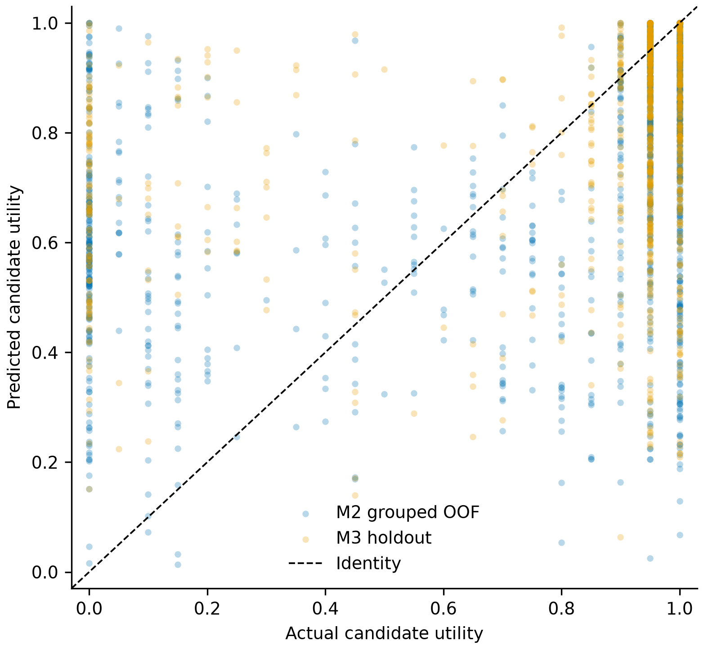
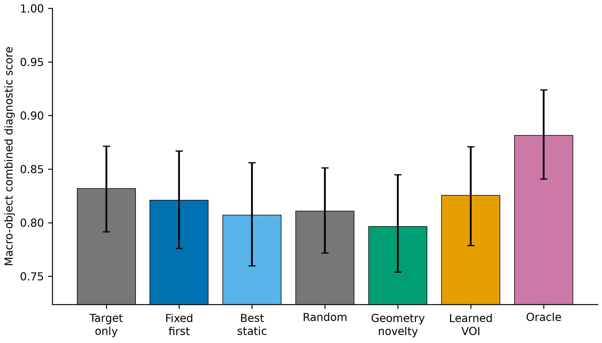
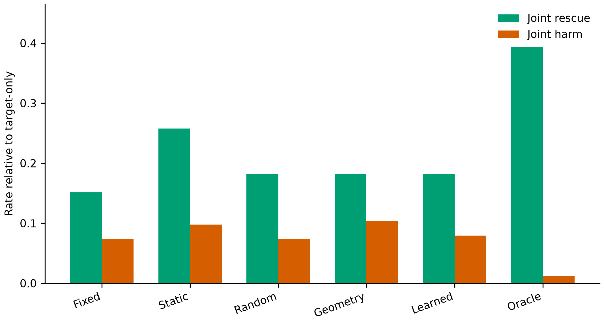
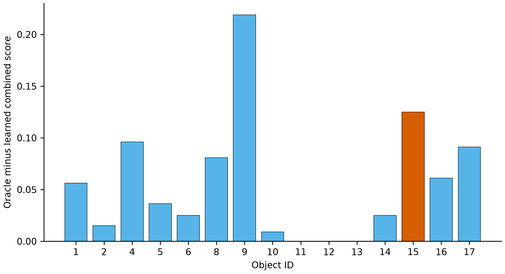

# PoseLoop M4 pre-acquisition one-step view ranking

## Answer first

The point-estimate interpretation gate supports candidate-specific pre-acquisition ranking: `learned_voi` beats `fixed_first`, `best_static_slot`, and the uniform-random expectation. All three paired 95% bootstrap intervals include zero, so this directional advantage is not statistically resolved. It remains -0.63 pp below the one-view target-only reference, so acquiring a second view is not an end-to-end population win under the common max-mask rule. The holdout has no low-visibility targets, so no low-visibility conditional claim can be tested.

`learned_voi` changes macro combined by
**+0.44 pp vs fixed-first**,
**+1.83 pp vs the M2-frozen
best static slot**, and **+1.45
pp vs uniform random expectation**. Its gap to the diagnostic oracle is
**5.60 pp**.

## Scope and hard caveats

- **Known object IDs, CAD models, camera extrinsics, and the current target mask are used.**
- **Ground truth is used for physical-instance association, utility labels, and final evaluation only.**
- **Candidate RGB, depth, mask, visibility, GT pose, and FoundationPose output are unavailable at selection time.**
- **The M4 model and best static slot were frozen from M2 before any M3 outcome evaluation.**
- **The reused M3 inference stream predates M4; no new FoundationPose inference was run.**
- **The holdout is physical-instance-disjoint from M2 but not scene-disjoint.**
- **Holdout object counts are unequal; macro-object metrics are primary.**
- **Per-object estimates with fewer than five targets are low-n descriptive results.**
- **All budget-matched methods acquire exactly the target plus one existing candidate view.**
- **These oracle-mask subset diagnostics are not official BOP detection AP.**

## Split, leakage, and freeze

Development contains **300 targets,
1200 target-candidate rows, and
169 physical instances**. Holdout
contains **230 targets,
920 target-candidate rows, and
230 physical instances**. The physical
instance intersection is exactly **0**; every target
has candidate slots 1--4.

The frozen M2-only configuration is
`98995bb2ed7725d96cce60d10e6a9405649561473964c9f2e8266780369cb6f0`. Existing M3 inference was created at
`2026-07-30T11:01:00.552075+00:00`, before the M4
freeze at `2026-07-30T19:24:10.073296+00:00`; this is expected because M4 reuses
the untouched stream. Holdout evaluation began at
`2026-07-30T19:52:33.044097+00:00`, after the freeze. Pre-acquisition
selection was hashed as `7f6dbf85a64dde34190527ef135dee94fa2a9d7df87214e9c12dd0e3a82d8802` before full
candidate prediction/outcome loading.

The runtime feature builder received only target observation/prediction fields,
candidate camera extrinsics, and CAD geometry. It received zero candidate
RGB/depth/mask, visibility, GT, FoundationPose prediction/score, outcome, or
stored `viewing_direction_world` fields. IDs remain audit metadata outside the
feature mapping. Exact features are
`['target_pose_usable', 'target_mask_area_fraction', 'target_bbox_width_fraction', 'target_bbox_height_fraction', 'target_bbox_area_fraction', 'target_mask_bbox_fill_fraction', 'target_bbox_aspect_log', 'target_mask_centroid_x_normalized', 'target_mask_centroid_y_normalized', 'target_valid_depth_ratio', 'target_depth_median_over_diameter', 'target_depth_iqr_over_diameter', 'target_depth_std_over_diameter', 'target_predicted_depth_over_diameter', 'target_predicted_translation_norm_over_diameter', 'target_predicted_lateral_over_depth', 'target_foundationpose_top_score', 'target_foundationpose_top_score_margin', 'cad_extent_x_over_diameter', 'cad_extent_y_over_diameter', 'cad_extent_z_over_diameter', 'cad_min_over_max_extent', 'cad_surface_area_over_diameter_sq', 'cad_volume_over_diameter_cubed', 'relative_view_angle_rad', 'relative_azimuth_change_sin', 'relative_azimuth_change_cos', 'relative_elevation_change_rad', 'camera_baseline_over_target_distance', 'camera_baseline_over_diameter', 'candidate_distance_over_target_distance', 'candidate_distance_delta_over_diameter', 'target_view_direction_object_x', 'target_view_direction_object_y', 'target_view_direction_object_z', 'candidate_view_direction_object_x', 'candidate_view_direction_object_y', 'candidate_view_direction_object_z', 'candidate_center_delta_object_x_over_diameter', 'candidate_center_delta_object_y_over_diameter', 'candidate_center_delta_object_z_over_diameter', 'cad_target_visible_area_fraction', 'cad_candidate_front_facing_area_fraction', 'cad_visible_area_ratio', 'cad_new_surface_fraction', 'cad_target_projected_size_proxy', 'cad_candidate_projected_size_proxy', 'cad_projected_size_ratio']`.

## Grouped M2 out-of-fold diagnostics

Five grouped folds have zero physical-instance overlap and test all 1,200 rows
once. Candidate utility prediction gives MAE
**0.2791**, RMSE
**0.3765**, mean defined per-target Spearman
**-0.0646**
over **186**
of 300 targets, mean regret
**0.1302**, and tie-aware oracle-best hit rate
**62.00%**.

OOF selected-pair pose scores are macro AR_MSSD
**66.70%**,
macro AR_MSPD
**73.43%**, and
macro combined
**70.07%**
(micro combined
**70.07%**).
The M2-only best static slot is
**2**, selected by macro-object
combined with lower-slot tie-breaking.

## Holdout method comparison

Macro-object scores are primary; micro scores are secondary unequal-count
summaries. Random's row is the exact per-target mean over four equiprobable
slots. Existing registration seconds are contextual only.

| Method | Macro AR_MSSD | Macro AR_MSPD | Macro combined | Micro AR_MSSD | Micro AR_MSPD | Micro combined | Mean registration seconds |
|---|---:|---:|---:|---:|---:|---:|---:|
| `target_only` | 80.96% | 85.40% | 83.18% | 77.48% | 84.96% | 81.22% | 1.140 |
| `fixed_first` | 80.42% | 83.79% | 82.11% | 78.04% | 84.00% | 81.02% | 2.278 |
| `best_static_slot` | 78.77% | 82.65% | 80.71% | 76.52% | 83.39% | 79.96% | 2.279 |
| `random_candidate` | 79.27% | 82.92% | 81.10% | 77.10% | 83.46% | 80.28% | 2.277 |
| `max_geometry_novelty` | 77.97% | 81.32% | 79.64% | 76.13% | 82.48% | 79.30% | 2.277 |
| `learned_voi` | 80.65% | 84.44% | 82.54% | 77.96% | 84.17% | 81.07% | 2.278 |
| `oracle_best_candidate` | 87.43% | 88.85% | 88.14% | 85.83% | 89.57% | 87.70% | 2.277 |

| Learned comparison | Macro combined change (pp) |
|---|---:|
| vs target-only | -0.63 |
| vs fixed-first | +0.44 |
| vs best static slot | +1.83 |
| vs random expectation | +1.45 |
| vs max geometry novelty | +2.90 |
| gap to oracle | -5.60 |

Oracle headroom closed is
**7.25% from
fixed-first**, **20.56%
from random expectation**, and
**7.25% from
the strongest nonlearned control
`fixed_first`**. Fractions are
unclipped and N/A when the oracle denominator is nonpositive.

## Rescue, harm, visibility, and object detail

| Method | Joint rescue rate | Joint harm rate | Expected rescued | Expected harmed |
|---|---:|---:|---:|---:|
| `fixed_first` | 15.15% | 7.32% | 10.00 | 12.00 |
| `best_static_slot` | 25.76% | 9.76% | 17.00 | 16.00 |
| `random_candidate` | 18.18% | 7.32% | 12.00 | 12.00 |
| `max_geometry_novelty` | 18.18% | 10.37% | 12.00 | 17.00 |
| `learned_voi` | 18.18% | 7.93% | 12.00 | 13.00 |
| `oracle_best_candidate` | 39.39% | 1.22% | 26.00 | 2.00 |

| Method | Low visibility | Mid visibility | High visibility |
|---|---:|---:|---:|
| `target_only` | N/A | 76.60% | 83.52% |
| `fixed_first` | N/A | 74.74% | 82.62% |
| `best_static_slot` | N/A | 74.88% | 80.99% |
| `random_candidate` | N/A | 68.31% | 82.39% |
| `max_geometry_novelty` | N/A | 61.98% | 81.69% |
| `learned_voi` | N/A | 74.20% | 83.48% |
| `oracle_best_candidate` | N/A | 77.55% | 89.10% |

The low-visibility holdout bin has zero targets, so its values are N/A rather
than zero.

| Object | Method | n | Low-n | AR_MSSD | AR_MSPD | Combined |
|---:|---|---:|:---:|---:|---:|---:|
| 1 | `target_only` | 48 | No | 64.17% | 75.00% | 69.58% |
| 1 | `fixed_first` | 48 | No | 63.54% | 72.29% | 67.92% |
| 1 | `best_static_slot` | 48 | No | 66.67% | 76.46% | 71.56% |
| 1 | `random_candidate` | 48 | No | 64.43% | 73.07% | 68.75% |
| 1 | `max_geometry_novelty` | 48 | No | 63.75% | 72.29% | 68.02% |
| 1 | `learned_voi` | 48 | No | 65.62% | 72.92% | 69.27% |
| 1 | `oracle_best_candidate` | 48 | No | 71.25% | 78.54% | 74.90% |
| 2 | `target_only` | 20 | No | 92.50% | 100.00% | 96.25% |
| 2 | `fixed_first` | 20 | No | 93.50% | 100.00% | 96.75% |
| 2 | `best_static_slot` | 20 | No | 92.00% | 100.00% | 96.00% |
| 2 | `random_candidate` | 20 | No | 92.62% | 100.00% | 96.31% |
| 2 | `max_geometry_novelty` | 20 | No | 91.50% | 100.00% | 95.75% |
| 2 | `learned_voi` | 20 | No | 92.00% | 100.00% | 96.00% |
| 2 | `oracle_best_candidate` | 20 | No | 95.00% | 100.00% | 97.50% |
| 4 | `target_only` | 13 | No | 85.38% | 92.31% | 88.85% |
| 4 | `fixed_first` | 13 | No | 87.69% | 92.31% | 90.00% |
| 4 | `best_static_slot` | 13 | No | 86.15% | 92.31% | 89.23% |
| 4 | `random_candidate` | 13 | No | 88.27% | 94.23% | 91.25% |
| 4 | `max_geometry_novelty` | 13 | No | 85.38% | 92.31% | 88.85% |
| 4 | `learned_voi` | 13 | No | 86.15% | 92.31% | 89.23% |
| 4 | `oracle_best_candidate` | 13 | No | 97.69% | 100.00% | 98.85% |
| 5 | `target_only` | 11 | No | 84.55% | 91.82% | 88.18% |
| 5 | `fixed_first` | 11 | No | 93.64% | 98.18% | 95.91% |
| 5 | `best_static_slot` | 11 | No | 94.55% | 100.00% | 97.27% |
| 5 | `random_candidate` | 11 | No | 93.41% | 98.64% | 96.02% |
| 5 | `max_geometry_novelty` | 11 | No | 93.64% | 99.09% | 96.36% |
| 5 | `learned_voi` | 11 | No | 90.91% | 98.18% | 94.55% |
| 5 | `oracle_best_candidate` | 11 | No | 96.36% | 100.00% | 98.18% |
| 6 | `target_only` | 2 | Yes | 100.00% | 100.00% | 100.00% |
| 6 | `fixed_first` | 2 | Yes | 95.00% | 100.00% | 97.50% |
| 6 | `best_static_slot` | 2 | Yes | 100.00% | 100.00% | 100.00% |
| 6 | `random_candidate` | 2 | Yes | 97.50% | 100.00% | 98.75% |
| 6 | `max_geometry_novelty` | 2 | Yes | 100.00% | 100.00% | 100.00% |
| 6 | `learned_voi` | 2 | Yes | 95.00% | 100.00% | 97.50% |
| 6 | `oracle_best_candidate` | 2 | Yes | 100.00% | 100.00% | 100.00% |
| 8 | `target_only` | 26 | No | 79.62% | 90.38% | 85.00% |
| 8 | `fixed_first` | 26 | No | 77.31% | 88.85% | 83.08% |
| 8 | `best_static_slot` | 26 | No | 84.23% | 92.69% | 88.46% |
| 8 | `random_candidate` | 26 | No | 79.52% | 88.85% | 84.18% |
| 8 | `max_geometry_novelty` | 26 | No | 77.31% | 88.85% | 83.08% |
| 8 | `learned_voi` | 26 | No | 76.92% | 86.92% | 81.92% |
| 8 | `oracle_best_candidate` | 26 | No | 86.92% | 93.08% | 90.00% |
| 9 | `target_only` | 21 | No | 50.48% | 49.52% | 50.00% |
| 9 | `fixed_first` | 21 | No | 52.38% | 50.00% | 51.19% |
| 9 | `best_static_slot` | 21 | No | 40.48% | 40.48% | 40.48% |
| 9 | `random_candidate` | 21 | No | 48.81% | 47.86% | 48.33% |
| 9 | `max_geometry_novelty` | 21 | No | 41.90% | 40.48% | 41.19% |
| 9 | `learned_voi` | 21 | No | 53.33% | 51.43% | 52.38% |
| 9 | `oracle_best_candidate` | 21 | No | 74.76% | 73.81% | 74.29% |
| 10 | `target_only` | 11 | No | 95.45% | 100.00% | 97.73% |
| 10 | `fixed_first` | 11 | No | 95.45% | 100.00% | 97.73% |
| 10 | `best_static_slot` | 11 | No | 97.27% | 100.00% | 98.64% |
| 10 | `random_candidate` | 11 | No | 96.59% | 100.00% | 98.30% |
| 10 | `max_geometry_novelty` | 11 | No | 96.36% | 100.00% | 98.18% |
| 10 | `learned_voi` | 11 | No | 97.27% | 100.00% | 98.64% |
| 10 | `oracle_best_candidate` | 11 | No | 99.09% | 100.00% | 99.55% |
| 11 | `target_only` | 7 | No | 97.14% | 100.00% | 98.57% |
| 11 | `fixed_first` | 7 | No | 68.57% | 72.86% | 70.71% |
| 11 | `best_static_slot` | 7 | No | 71.43% | 71.43% | 71.43% |
| 11 | `random_candidate` | 7 | No | 76.79% | 78.57% | 77.68% |
| 11 | `max_geometry_novelty` | 7 | No | 68.57% | 72.86% | 70.71% |
| 11 | `learned_voi` | 7 | No | 84.29% | 85.71% | 85.00% |
| 11 | `oracle_best_candidate` | 7 | No | 84.29% | 85.71% | 85.00% |
| 12 | `target_only` | 4 | Yes | 67.50% | 62.50% | 65.00% |
| 12 | `fixed_first` | 4 | Yes | 55.00% | 50.00% | 52.50% |
| 12 | `best_static_slot` | 4 | Yes | 55.00% | 50.00% | 52.50% |
| 12 | `random_candidate` | 4 | Yes | 49.38% | 43.75% | 46.56% |
| 12 | `max_geometry_novelty` | 4 | Yes | 32.50% | 25.00% | 28.75% |
| 12 | `learned_voi` | 4 | Yes | 55.00% | 50.00% | 52.50% |
| 12 | `oracle_best_candidate` | 4 | Yes | 55.00% | 50.00% | 52.50% |
| 13 | `target_only` | 12 | No | 89.17% | 91.67% | 90.42% |
| 13 | `fixed_first` | 12 | No | 90.83% | 91.67% | 91.25% |
| 13 | `best_static_slot` | 12 | No | 90.83% | 91.67% | 91.25% |
| 13 | `random_candidate` | 12 | No | 90.83% | 91.67% | 91.25% |
| 13 | `max_geometry_novelty` | 12 | No | 90.83% | 91.67% | 91.25% |
| 13 | `learned_voi` | 12 | No | 90.83% | 91.67% | 91.25% |
| 13 | `oracle_best_candidate` | 12 | No | 90.83% | 91.67% | 91.25% |
| 14 | `target_only` | 14 | No | 91.43% | 99.29% | 95.36% |
| 14 | `fixed_first` | 14 | No | 93.57% | 99.29% | 96.43% |
| 14 | `best_static_slot` | 14 | No | 92.14% | 99.29% | 95.71% |
| 14 | `random_candidate` | 14 | No | 92.32% | 99.46% | 95.89% |
| 14 | `max_geometry_novelty` | 14 | No | 92.14% | 99.29% | 95.71% |
| 14 | `learned_voi` | 14 | No | 91.43% | 99.29% | 95.36% |
| 14 | `oracle_best_candidate` | 14 | No | 95.71% | 100.00% | 97.86% |
| 15 | `target_only` | 6 | No | 55.00% | 35.00% | 45.00% |
| 15 | `fixed_first` | 6 | No | 68.33% | 45.00% | 56.67% |
| 15 | `best_static_slot` | 6 | No | 60.00% | 41.67% | 50.83% |
| 15 | `random_candidate` | 6 | No | 59.17% | 38.33% | 48.75% |
| 15 | `max_geometry_novelty` | 6 | No | 68.33% | 45.00% | 56.67% |
| 15 | `learned_voi` | 6 | No | 68.33% | 45.00% | 56.67% |
| 15 | `oracle_best_candidate` | 6 | No | 78.33% | 60.00% | 69.17% |
| 16 | `target_only` | 18 | No | 86.67% | 100.00% | 93.33% |
| 16 | `fixed_first` | 18 | No | 85.00% | 100.00% | 92.50% |
| 16 | `best_static_slot` | 18 | No | 66.67% | 85.56% | 76.11% |
| 16 | `random_candidate` | 18 | No | 80.42% | 95.00% | 87.71% |
| 16 | `max_geometry_novelty` | 18 | No | 86.11% | 100.00% | 93.06% |
| 16 | `learned_voi` | 18 | No | 83.89% | 97.22% | 90.56% |
| 16 | `oracle_best_candidate` | 18 | No | 93.33% | 100.00% | 96.67% |
| 17 | `target_only` | 17 | No | 75.29% | 93.53% | 84.41% |
| 17 | `fixed_first` | 17 | No | 86.47% | 96.47% | 91.47% |
| 17 | `best_static_slot` | 17 | No | 84.12% | 98.24% | 91.18% |
| 17 | `random_candidate` | 17 | No | 78.97% | 94.41% | 86.69% |
| 17 | `max_geometry_novelty` | 17 | No | 81.18% | 92.94% | 87.06% |
| 17 | `learned_voi` | 17 | No | 78.82% | 95.88% | 87.35% |
| 17 | `oracle_best_candidate` | 17 | No | 92.94% | 100.00% | 96.47% |

Object 15 is shown explicitly:

| Method | n | AR_MSSD | AR_MSPD | Combined |
|---|---:|---:|---:|---:|
| `target_only` | 6 | 55.00% | 35.00% | 45.00% |
| `fixed_first` | 6 | 68.33% | 45.00% | 56.67% |
| `best_static_slot` | 6 | 60.00% | 41.67% | 50.83% |
| `random_candidate` | 6 | 59.17% | 38.33% | 48.75% |
| `max_geometry_novelty` | 6 | 68.33% | 45.00% | 56.67% |
| `learned_voi` | 6 | 68.33% | 45.00% | 56.67% |
| `oracle_best_candidate` | 6 | 78.33% | 60.00% | 69.17% |

## Candidate-slot selections

| Method | Slot 1 | Slot 2 | Slot 3 | Slot 4 |
|---|---:|---:|---:|---:|
| `fixed_first` | 100.00% | 0.00% | 0.00% | 0.00% |
| `best_static_slot` | 0.00% | 100.00% | 0.00% | 0.00% |
| `random_candidate (seeded assignments)` | 24.98% | 25.02% | 25.01% | 24.98% |
| `max_geometry_novelty` | 63.04% | 21.30% | 11.30% | 4.35% |
| `learned_voi` | 24.78% | 26.96% | 22.17% | 26.09% |
| `oracle_best_candidate` | 71.30% | 15.22% | 7.83% | 5.65% |

Random frequencies pool all
`2000` seeded whole-holdout assignments. The random
macro combined assignment median is
`0.8115` and its
central 95% assignment range is
`[78.63%, 83.35%]`. The main-table random
point estimate is instead the exact four-slot mean. This assignment range
measures assignment variation, not physical-instance uncertainty; the bootstrap
below measures physical-instance sampling uncertainty.

## Object-stratified physical-instance bootstrap

The paired bootstrap uses the same within-object resamples for every method.
Random uses the exact four-slot per-target expectation, not one Monte Carlo
assignment.

| Method | Macro combined 95% CI |
|---|---:|
| `target_only` | [79.14%, 87.13%] |
| `fixed_first` | [77.59%, 86.68%] |
| `best_static_slot` | [75.96%, 85.59%] |
| `random_candidate` | [77.15%, 85.10%] |
| `max_geometry_novelty` | [75.38%, 84.46%] |
| `learned_voi` | [77.87%, 87.09%] |
| `oracle_best_candidate` | [84.07%, 92.38%] |

| Paired comparison | Macro combined 95% CI |
|---|---:|
| learned minus target_only | [-3.76, +2.50] pp |
| learned minus fixed_first | [-1.45, +2.74] pp |
| learned minus best_static_slot | [-1.31, +5.20] pp |
| learned minus random_candidate | [-0.31, +3.28] pp |
| learned minus max_geometry_novelty | [-0.41, +6.77] pp |
| oracle minus learned | [+3.40, +7.99] pp |

## Provenance and reconstruction

The M2 official two-view slot-1 and existing M3 k=1/k=3/k=5 max-mask
metric-anchor reconstructions all pass with maximum numeric delta
`4.388e-13`. The
official symmetry-aware evaluator uses BOP Toolkit commit
`cea62d651c7e395b2e1962b9749e4e89693c6ac4`, `models_eval`, and
`max_sym_disc_step =
0.01`. The cross-view GT transform
gate remains unchanged.
