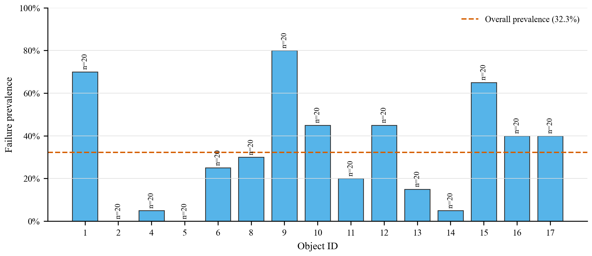
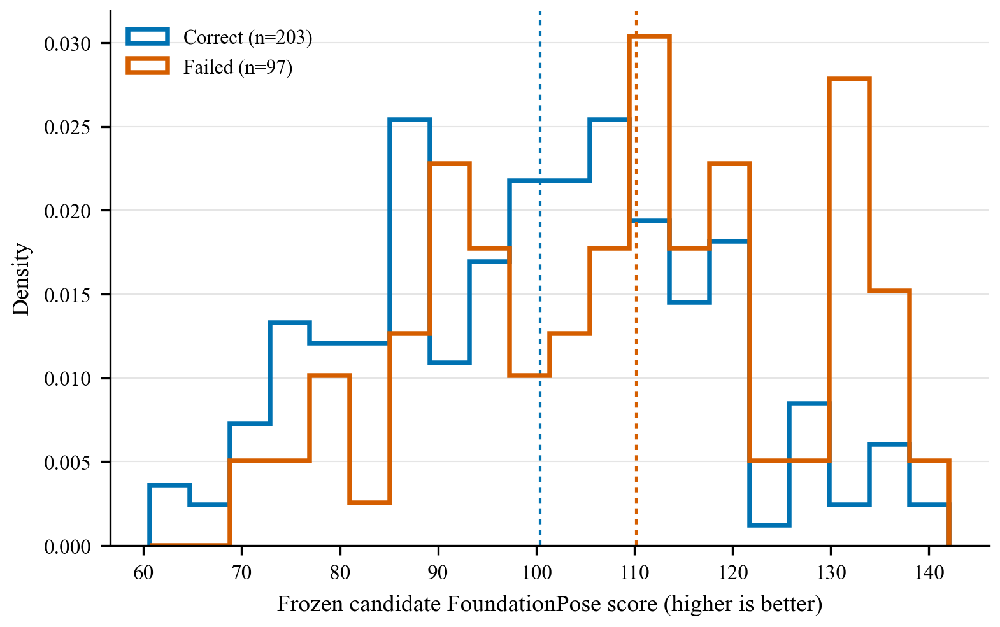
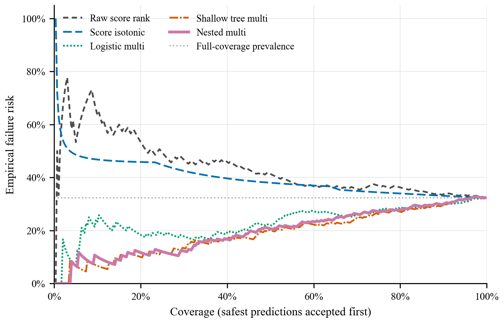
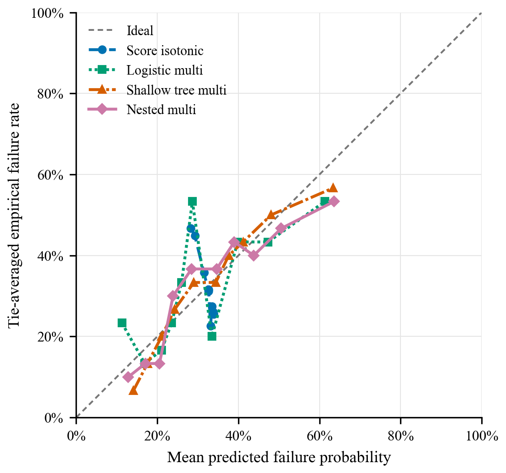
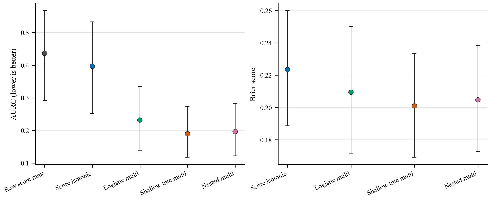
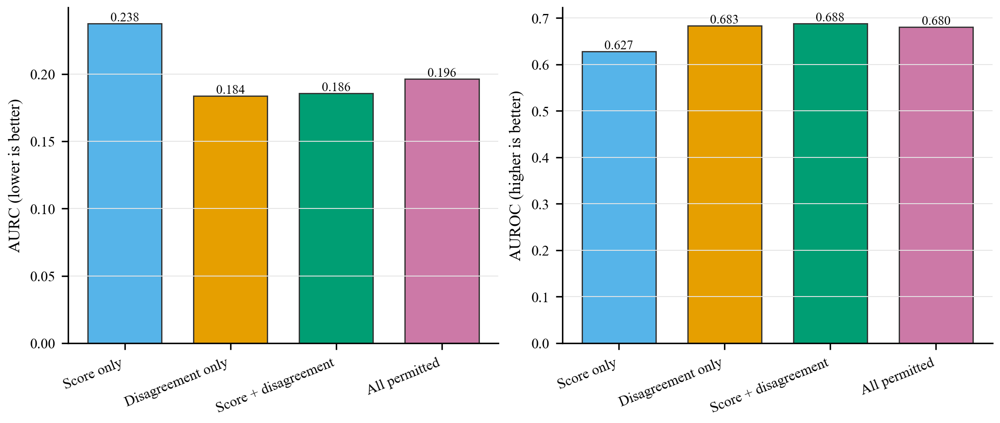
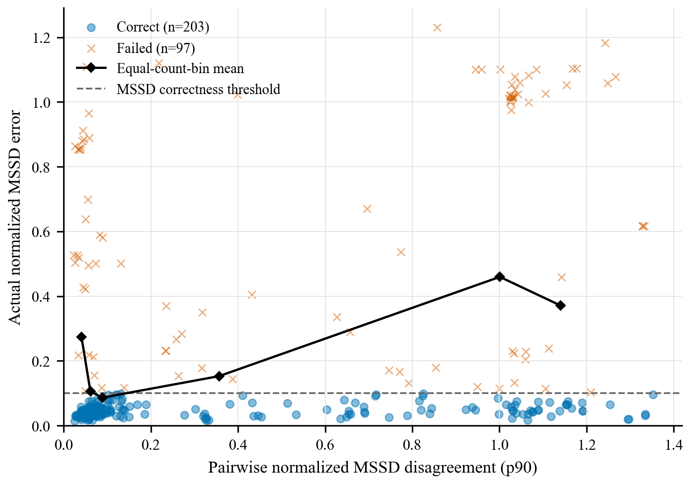
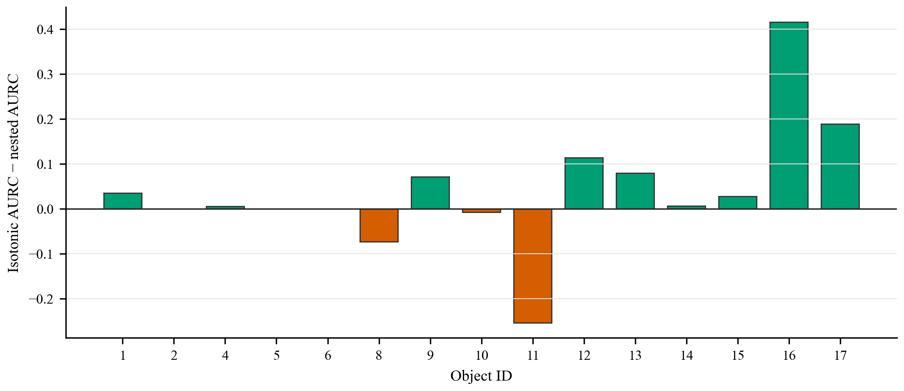
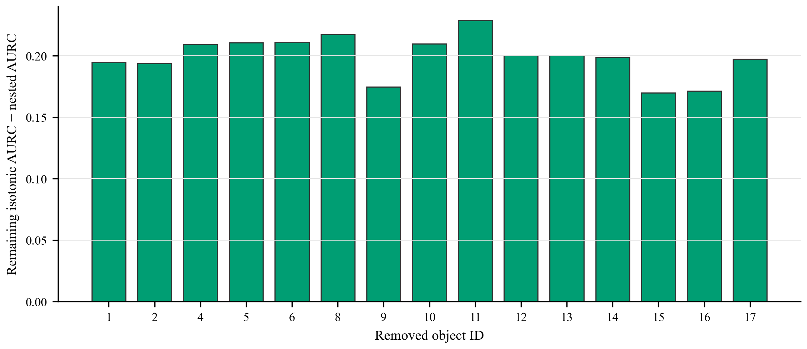

# PoseLoop M6-G0 Existing-Data Confidence Signal Audit

> **Formal classification: NO-GO. M3 holdout authorized: NO.**
>
> M5-G0 remained NO-GO. M6-G0 uses only M2 development data. No
> FoundationPose inference was run and no new pose estimates were generated.
> These are grouped cross-validation results, not sealed holdout evidence, and
> no conformal or formal risk guarantee is claimed.

## Executive result

The formal candidate was `NESTED_MULTIFEATURE`. Its pooled OOF AUROC was
**0.6803**, AUPRC **0.4512**, Brier
**0.2047**, ECE **0.0524**, and AURC
**0.1963**. The frozen decision is **NO-GO**.
The purely numerical counterfactual with the report-information gate removed
would be **NO-GO**; it is disclosed only as a diagnostic and does not
authorize holdout use.

## Non-negotiable evidence boundary

- M5-G0 remained NO-GO; this audit neither reopens nor upgrades it.
- The analysis used only the existing M2 development targets.
- M3 raw artifacts and protected hashes remained unchanged. No raw structured
  M3 target rows, labels, predictions, candidate values, object outcomes, or
  per-target metrics entered features, fitting, scoring, or selection.
- The strict report-information boundary **FAILED** because
  `reports/m3_active_budget.md` was accidentally displayed as documentation
  context before this audit. Displayed values were not used by M6-G0. This gate
  failure conservatively forces formal **NO-GO** and keeps the M3 holdout
  unauthorized.
- No FoundationPose inference was run; no new pose estimates were generated.
- Grouped cross-validation is development evidence, not a sealed holdout.
- No conformal guarantee, formal risk guarantee, deployment guarantee,
  FoundationPose improvement, or robot-control claim is made.

## Frozen output and correctness label

The calibrated output is the pre-existing five-view `symmetry_aware_medoid`,
implemented by `scripts/evaluate_m2.py:choose_medoid`. It receives the five
fixed-order M2 candidates transformed into the target-camera frame, excludes
failed/non-finite poses, minimizes mean bidirectional official symmetry-aware
MSSD normalized by official object diameter, and breaks ties by acquisition
rank then sample ID. It returns one existing candidate pose in
`T_target_camera_object` convention (metres), not a fused pose. It was frozen
before M6 labels and is the correct non-oracle deployable pose output to audit;
M6 did not compare final-pose methods.

The evaluator-only label is
`y_failure = int(not diagnostic_success.joint)` for the frozen medoid at view
budget 5. Correct means a finite pose with normalized symmetry-aware MSSD ≤
0.10 object diameter and symmetry-aware MSPD ≤ `10*r`, where
`r = target image width / 640`. Comparisons are inclusive. The label was not
tuned for class balance or predictability.

| Support quantity | Observed | Frozen minimum | Result |
| --- | --- | --- | --- |
| Targets | 300 | — | INFO |
| Failures | 97 | 30 | PASS |
| Successes | 203 | 30 | PASS |
| Physical instances with failures | 46 | 10 | PASS |
| Objects with failures | 13 | 5 | PASS |
| Failure prevalence | 32.3% | — | INFO |

## Features, prohibitions, and causal separation

One inference-time row was constructed per M2 target. Frozen families were raw
score; score distribution; candidate/view availability; pairwise
symmetry-aware translation, rotation, and MSSD disagreement; candidate-to-output
agreement; and explicit view consistency. Model matrices excluded ground-truth
pose, target pose error, evaluator/BOP residuals, correctness/success/failure,
oracle-best-candidate information, object ID, physical-instance ID, scene ID,
target ID, split ID, M3 metadata, and all future/held-out outcomes. Identifiers
were used only for grouping, alignment, robustness, and qualitative audit.

## Formal methods and grouped nested cross-validation

| Method | Frozen role | Fitting/selection boundary |
| --- | --- | --- |
| RAW_SCORE_RANK | Primary raw-confidence ranking baseline | No fitted model; frozen score direction |
| SCORE_ISOTONIC | One-dimensional score calibration | Fit on outer training only |
| LOGISTIC_MULTIFEATURE | Standardized L2 logistic regression | Training-fold median imputation; inner grouped C grid |
| SHALLOW_TREE_MULTIFEATURE | Depth≤3 random forest with ≤100 trees | Inner grouped grid; training-only inner-OOF sigmoid calibration |
| NESTED_MULTIFEATURE | Formal candidate | Per outer fold, inner grouped AURC family/parameter selection; logistic preferred within 0.005 |

There were **5** frozen outer folds (`[0, 1, 2, 3, 4]`), grouped by
physical instance and stratified by failure label plus object where feasible.
Every formal method used identical outer folds; preprocessing, imputation,
hyperparameter selection, and calibration remained inside outer training data.
Fold-manifest hash: `sha256:d601da4da53c9beef03238e5f31b4697c1699b03986b31ddbdb51d8fae83f7e2`.

## Full pooled out-of-fold results

### Discrimination and calibration
| Formal method | AUROC | AUPRC | Failure prevalence | AUPRC lift | Brier | Log loss | ECE | MCE | Calibration slope | Calibration intercept |
| --- | --- | --- | --- | --- | --- | --- | --- | --- | --- | --- |
| Raw score rank | 0.3579 | 0.2563 | 32.3% | 0.7927 | NA | NA | NA | NA | NA | NA |
| Score isotonic | 0.4095 | 0.2870 | 32.3% | 0.8876 | 0.2234 | 0.7472 | 0.0746 | 0.1849 | -4.1756 | -3.8759 |
| Logistic multi | 0.6434 | 0.4592 | 32.3% | 1.4201 | 0.2094 | 0.6087 | 0.0812 | 0.2469 | 0.6873 | -0.1669 |
| Shallow tree multi | 0.6965 | 0.4712 | 32.3% | 1.4572 | 0.2009 | 0.5858 | 0.0338 | 0.0746 | 0.9405 | -0.0752 |
| Nested multi | 0.6803 | 0.4512 | 32.3% | 1.3955 | 0.2047 | 0.5934 | 0.0524 | 0.1028 | 0.8140 | -0.1715 |

RAW_SCORE_RANK has no fitted probability, so its calibration fields are intentionally `NA`.

### Selective prediction
| Formal method | AURC | Rel. vs raw | Rel. vs isotonic | Risk @ 50% cov. | Risk @ 80% cov. | Risk @ 90% cov. | Cov. @ ≤5% empirical | Cov. @ ≤10% empirical | Cov. @ ≤20% empirical | Count p≤.05 | Cov. p≤.05 | Empirical risk p≤.05 |
| --- | --- | --- | --- | --- | --- | --- | --- | --- | --- | --- | --- | --- |
| Raw score rank | 0.4361 | 0.0% | -10.0% | 41.3% | 36.2% | 33.7% | 0.3% | 0.3% | 0.3% | NA | NA | NA |
| Score isotonic | 0.3965 | 9.1% | 0.0% | 38.0% | 34.0% | 33.1% | 0.0% | 0.0% | 0.0% | 1 | 0.3% | 100.0% |
| Logistic multi | 0.2318 | 46.9% | 41.5% | 22.0% | 28.3% | 30.0% | 1.7% | 5.0% | 43.7% | 2 | 0.7% | 0.0% |
| Shallow tree multi | 0.1895 | 56.6% | 52.2% | 20.0% | 27.1% | 29.6% | 7.3% | 20.3% | 51.0% | 0 | 0.0% | NA |
| Nested multi | 0.1963 | 55.0% | 50.5% | 20.7% | 27.9% | 30.0% | 3.7% | 16.7% | 47.0% | 1 | 0.3% | 0.0% |

Coverage metrics use the complete safest-to-riskiest OOF ordering. Equal-risk blocks use their tie-invariant expected prefix risk, so audit identifiers never determine model ranking; lower AURC is better.

### Grouped-bootstrap 95% confidence intervals
| Formal method | AUROC CI | AUPRC CI | Brier CI | AURC CI | Risk @ 80% CI | Coverage p≤.05 CI |
| --- | --- | --- | --- | --- | --- | --- |
| Raw score rank | [0.2381, 0.4791] | [0.1769, 0.3684] | NA | [0.2924, 0.5666] | [25.5%, 47.2%] | NA |
| Score isotonic | [0.3053, 0.5295] | [0.2114, 0.3825] | [0.1886, 0.2598] | [0.2523, 0.5322] | [23.2%, 45.2%] | [0.0%, 1.1%] |
| Logistic multi | [0.5411, 0.7457] | [0.3191, 0.6290] | [0.1713, 0.2503] | [0.1373, 0.3349] | [18.8%, 38.8%] | [0.0%, 1.7%] |
| Shallow tree multi | [0.5947, 0.7863] | [0.3226, 0.6504] | [0.1692, 0.2335] | [0.1179, 0.2733] | [19.0%, 36.8%] | [0.0%, 0.0%] |
| Nested multi | [0.5807, 0.7703] | [0.3153, 0.6213] | [0.1727, 0.2383] | [0.1219, 0.2823] | [19.3%, 38.0%] | [0.0%, 1.0%] |

Paired grouped-bootstrap differences use whole physical instances as the resampling unit. Positive AURC improvement means the nested candidate has lower AURC.

| Paired quantity | 95% CI |
| --- | --- |
| aurc improvement vs raw score rank | [0.1146, 0.3569] |
| aurc improvement vs score isotonic | [0.0787, 0.3069] |
| coverage at predicted risk 0 05 | [0.0000, 0.0105] |
| risk at coverage 0 80 difference vs raw score rank | [-0.1297, -0.0208] |
| risk at coverage 0 80 difference vs score isotonic | [-0.1047, -0.0048] |

## Fold-level OOF results

| Outer fold | Method | Targets | Failures | AUROC | AUPRC | Brier | ECE | AURC | Risk @ 80% |
| --- | --- | --- | --- | --- | --- | --- | --- | --- | --- |
| 0 | Logistic multi | 62 | 20 | 0.3738 | 0.2890 | 0.2777 | 0.2655 | 0.4265 | 32.0% |
| 0 | Nested multi | 62 | 20 | 0.3964 | 0.2822 | 0.2803 | 0.2793 | 0.3722 | 34.0% |
| 0 | Raw score rank | 62 | 20 | 0.6952 | 0.5878 | NA | NA | 0.2675 | 26.0% |
| 0 | Score isotonic | 62 | 20 | 0.4750 | 0.3120 | 0.2273 | 0.0278 | 0.3638 | 32.5% |
| 0 | Shallow tree multi | 62 | 20 | 0.3964 | 0.2822 | 0.2803 | 0.2793 | 0.3722 | 34.0% |
| 1 | Logistic multi | 60 | 19 | 0.8537 | 0.8352 | 0.1485 | 0.1750 | 0.1396 | 16.7% |
| 1 | Nested multi | 60 | 19 | 0.8575 | 0.7886 | 0.1619 | 0.1825 | 0.1225 | 18.8% |
| 1 | Raw score rank | 60 | 19 | 0.1643 | 0.2388 | NA | NA | 0.6000 | 33.3% |
| 1 | Score isotonic | 60 | 19 | 0.5000 | 0.3167 | 0.2165 | 0.0097 | 0.3167 | 31.7% |
| 1 | Shallow tree multi | 60 | 19 | 0.8575 | 0.7886 | 0.1619 | 0.1825 | 0.1225 | 18.8% |
| 2 | Logistic multi | 51 | 14 | 0.5560 | 0.3100 | 0.2146 | 0.2204 | 0.2070 | 29.3% |
| 2 | Nested multi | 51 | 14 | 0.5560 | 0.3100 | 0.2146 | 0.2204 | 0.2070 | 29.3% |
| 2 | Raw score rank | 51 | 14 | 0.4614 | 0.2690 | NA | NA | 0.2976 | 31.7% |
| 2 | Score isotonic | 51 | 14 | 0.5000 | 0.2745 | 0.2028 | 0.0602 | 0.2745 | 27.5% |
| 2 | Shallow tree multi | 51 | 14 | 0.6197 | 0.3723 | 0.1926 | 0.1045 | 0.1796 | 24.4% |
| 3 | Logistic multi | 51 | 13 | 0.7510 | 0.6481 | 0.1572 | 0.2127 | 0.1483 | 17.1% |
| 3 | Nested multi | 51 | 13 | 0.7206 | 0.5281 | 0.1734 | 0.0990 | 0.1424 | 19.5% |
| 3 | Raw score rank | 51 | 13 | 0.3553 | 0.2211 | NA | NA | 0.3514 | 26.8% |
| 3 | Score isotonic | 51 | 13 | 0.5000 | 0.2549 | 0.1970 | 0.0838 | 0.2549 | 25.5% |
| 3 | Shallow tree multi | 51 | 13 | 0.7206 | 0.5281 | 0.1734 | 0.0990 | 0.1424 | 19.5% |
| 4 | Logistic multi | 76 | 31 | 0.8072 | 0.6886 | 0.2332 | 0.2055 | 0.1838 | 32.8% |
| 4 | Nested multi | 76 | 31 | 0.8552 | 0.7444 | 0.1911 | 0.2021 | 0.1573 | 32.8% |
| 4 | Raw score rank | 76 | 31 | 0.2215 | 0.2940 | NA | NA | 0.6139 | 50.8% |
| 4 | Score isotonic | 76 | 31 | 0.4222 | 0.4079 | 0.2572 | 0.1731 | 0.4470 | 44.9% |
| 4 | Shallow tree multi | 76 | 31 | 0.8552 | 0.7444 | 0.1911 | 0.2021 | 0.1573 | 32.8% |

## Training-only model selections

| Outer fold | Train n | Test n | Nested family | Selected parameters | Inner logistic AURC | Inner tree AURC | Tree advantage | Logistic tie rule | Outer labels used |
| --- | --- | --- | --- | --- | --- | --- | --- | --- | --- |
| 0 | 238 | 62 | tree | `{"max_depth": 3, "min_samples_leaf": 10, "n_estimators": 50}` | 0.1658 | 0.1440 | 0.0219 | False | False |
| 1 | 240 | 60 | tree | `{"max_depth": 2, "min_samples_leaf": 20, "n_estimators": 100}` | 0.2792 | 0.1885 | 0.0908 | False | False |
| 2 | 249 | 51 | logistic | `{"C": 0.01}` | 0.1819 | 0.1962 | -0.0143 | False | False |
| 3 | 249 | 51 | tree | `{"max_depth": 3, "min_samples_leaf": 10, "n_estimators": 100}` | 0.2275 | 0.1779 | 0.0496 | False | False |
| 4 | 224 | 76 | tree | `{"max_depth": 2, "min_samples_leaf": 20, "n_estimators": 50}` | 0.2070 | 0.1888 | 0.0181 | False | False |

The fixed logistic grid was `C ∈ {0.01, 0.1, 1, 10}`. The fixed shallow
random-forest grid used depth 2 or 3, 50 or 100 trees, and minimum leaf size 10
or 20. Outer-test labels were never used for model or hyperparameter selection.

## Feature ablations

| Ablation | Features | AUROC | AUPRC | Brier | ECE | AURC | Rel. AURC vs raw | OOF folds |
| --- | --- | --- | --- | --- | --- | --- | --- | --- |
| Score only | 14 | 0.6273 | 0.4025 | 0.2136 | 0.0833 | 0.2376 | 45.5% | 5 |
| Disagreement only | 34 | 0.6828 | 0.4480 | 0.2055 | 0.1135 | 0.1837 | 57.9% | 5 |
| Score + disagreement | 48 | 0.6881 | 0.4503 | 0.2026 | 0.0632 | 0.1856 | 57.5% | 5 |
| All permitted | 55 | 0.6803 | 0.4512 | 0.2047 | 0.0524 | 0.1963 | 55.0% | 5 |

## Feature contributions

Logistic values are standardized coefficients. The table shows the 15 largest absolute fold means; the complete fold vectors remain in the machine-readable artifact.

| Feature | Mean coefficient | Fold SD | Minimum | Maximum | Sign consistency |
| --- | --- | --- | --- | --- | --- |
| score_range | -0.1013 | 0.0148 | -0.1163 | -0.0796 | 100.0% |
| view_score_range | -0.1013 | 0.0148 | -0.1163 | -0.0796 | 100.0% |
| score_std | -0.0923 | 0.0161 | -0.1159 | -0.0709 | 100.0% |
| view_score_std | -0.0923 | 0.0161 | -0.1159 | -0.0709 | 100.0% |
| score_top1_minus_top2 | -0.0910 | 0.0168 | -0.1153 | -0.0737 | 100.0% |
| agreement_fraction_0_10d | -0.0851 | 0.0089 | -0.0944 | -0.0703 | 100.0% |
| agreeing_view_count_0_10d | -0.0851 | 0.0089 | -0.0944 | -0.0703 | 100.0% |
| output_supported_by_multiple_views_0_10d | -0.0826 | 0.0358 | -0.1162 | -0.0235 | 100.0% |
| candidate_to_output_rotation_deg_median | 0.0773 | 0.0343 | 0.0176 | 0.1056 | 100.0% |
| pair_translation_mm_max | 0.0610 | 0.0435 | -0.0133 | 0.0993 | 80.0% |
| candidate_to_output_normalized_mssd_median | 0.0610 | 0.0362 | 0.0132 | 0.0973 | 100.0% |
| pair_translation_mm_p90 | 0.0590 | 0.0436 | -0.0167 | 0.0933 | 80.0% |
| candidate_to_output_translation_mm_max | 0.0589 | 0.0412 | -0.0131 | 0.0904 | 80.0% |
| raw_selected_score | 0.0469 | 0.0286 | 0.0127 | 0.0901 | 100.0% |
| mutually_agreeing_view_count_0_10d | -0.0464 | 0.0152 | -0.0636 | -0.0262 | 100.0% |

Tree values are outer-test permutation AURC increases, never impurity-only importance. The table shows the 15 largest means.

| Feature | Mean AURC increase | Across-fold SD | Fold rows |
| --- | --- | --- | --- |
| candidate_to_output_translation_mm_median | 0.0129 | 0.0064 | 5 |
| pair_translation_mm_median | 0.0095 | 0.0076 | 5 |
| score_std | 0.0086 | 0.0073 | 5 |
| view_score_std | 0.0073 | 0.0074 | 5 |
| pair_normalized_mssd_max | 0.0072 | 0.0077 | 5 |
| candidate_to_output_normalized_mssd_median | 0.0057 | 0.0039 | 5 |
| score_top1_minus_top2 | 0.0052 | 0.0017 | 5 |
| score_range | 0.0040 | 0.0047 | 5 |
| candidate_to_output_rotation_deg_median | 0.0022 | 0.0031 | 5 |
| candidate_to_output_translation_mm_max | 0.0021 | 0.0041 | 5 |
| pair_translation_mm_max | 0.0021 | 0.0050 | 5 |
| pair_normalized_mssd_p90 | 0.0017 | 0.0025 | 5 |
| view_score_range | 0.0016 | 0.0062 | 5 |
| pair_normalized_mssd_median | 0.0016 | 0.0023 | 5 |
| top_score_to_output_translation_mm | 0.0016 | 0.0032 | 5 |

## Object and physical-instance robustness

Aggregate isotonic-minus-nested absolute AURC gain: **0.2002**. Object-driven flag: **True**. Frozen flags: `{"one_instance_exceeds_20_percent_of_gain": true, "one_object_exceeds_40_percent_of_gain": false, "removing_one_object_reverses_improvement": false}`.

### Per-object OOF diagnostics

| Object | Targets | Failures | Prevalence | Nested AUROC | Nested AURC | Risk @ 80% |
| --- | --- | --- | --- | --- | --- | --- |
| 1 | 20 | 14 | 70.0% | 0.2976 | 0.7420 | 75.0% |
| 2 | 20 | 0 | 0.0% | NA | 0.0000 | 0.0% |
| 4 | 20 | 1 | 5.0% | 1.0000 | 0.0025 | 0.0% |
| 5 | 20 | 0 | 0.0% | NA | 0.0000 | 0.0% |
| 6 | 20 | 5 | 25.0% | 0.1333 | 0.3919 | 31.2% |
| 8 | 20 | 6 | 30.0% | 0.5595 | 0.2717 | 25.0% |
| 9 | 20 | 16 | 80.0% | 0.4688 | 0.8001 | 81.2% |
| 10 | 20 | 9 | 45.0% | 0.4141 | 0.4396 | 56.2% |
| 11 | 20 | 4 | 20.0% | 0.2344 | 0.3086 | 25.0% |
| 12 | 20 | 9 | 45.0% | 0.5051 | 0.4037 | 50.0% |
| 13 | 20 | 3 | 15.0% | 0.7647 | 0.0522 | 18.8% |
| 14 | 20 | 1 | 5.0% | 0.9474 | 0.0051 | 0.0% |
| 15 | 20 | 13 | 65.0% | 0.2418 | 0.7772 | 75.0% |
| 16 | 20 | 8 | 40.0% | 0.8333 | 0.2279 | 25.0% |
| 17 | 20 | 8 | 40.0% | 0.8542 | 0.1621 | 31.2% |

### Leave-one-object-out jackknife

| Removed object | Remaining n | Absolute gain | Relative gain | Non-negative | Aggregate-gain change | Additive gain contribution | Fraction of gain |
| --- | --- | --- | --- | --- | --- | --- | --- |
| 1 | 280 | 0.1946 | 52.5% | True | 0.0056 | 0.0239 | 12.0% |
| 2 | 280 | 0.1938 | 45.6% | True | 0.0065 | 0.0000 | 0.0% |
| 4 | 280 | 0.2090 | 49.4% | True | -0.0088 | -0.0002 | -0.1% |
| 5 | 280 | 0.2107 | 49.9% | True | -0.0104 | 0.0000 | 0.0% |
| 6 | 280 | 0.2108 | 53.1% | True | -0.0106 | -0.0109 | -5.5% |
| 8 | 280 | 0.2172 | 52.8% | True | -0.0170 | 0.0028 | 1.4% |
| 9 | 280 | 0.1747 | 50.3% | True | 0.0255 | 0.0533 | 26.6% |
| 10 | 280 | 0.2099 | 53.2% | True | -0.0097 | -0.0020 | -1.0% |
| 11 | 280 | 0.2289 | 54.8% | True | -0.0286 | -0.0089 | -4.4% |
| 12 | 280 | 0.2006 | 51.9% | True | -0.0003 | 0.0162 | 8.1% |
| 13 | 280 | 0.2005 | 49.4% | True | -0.0003 | 0.0010 | 0.5% |
| 14 | 280 | 0.1987 | 47.1% | True | 0.0015 | -0.0016 | -0.8% |
| 15 | 280 | 0.1700 | 48.2% | True | 0.0303 | 0.0670 | 33.4% |
| 16 | 280 | 0.1714 | 46.7% | True | 0.0288 | 0.0454 | 22.7% |
| 17 | 280 | 0.1975 | 49.7% | True | 0.0027 | 0.0142 | 7.1% |

### Object contribution to correctly deferred failures

| Object | Expected correctly deferred failures | Fraction |
| --- | --- | --- |
| 1 | 2 | 6.7% |
| 2 | 0 | 0.0% |
| 4 | 1 | 3.3% |
| 5 | 0 | 0.0% |
| 6 | 0 | 0.0% |
| 8 | 2 | 6.7% |
| 9 | 7 | 23.3% |
| 10 | 0 | 0.0% |
| 11 | 1 | 3.3% |
| 12 | 0 | 0.0% |
| 13 | 3 | 10.0% |
| 14 | 0 | 0.0% |
| 15 | 4 | 13.3% |
| 16 | 4 | 13.3% |
| 17 | 6 | 20.0% |

<details><summary>Complete physical-instance AURC-gain contribution table</summary>

| Physical instance | Targets | Leave-one-out gain | Gain contribution | Fraction of gain |
| --- | --- | --- | --- | --- |
| xyzibd-val-s000000-o000016-r000000 | 1 | 0.1997 | 0.0000 | 0.0% |
| xyzibd-val-s000000-o000016-r000003 | 1 | 0.1997 | 0.0000 | 0.0% |
| xyzibd-val-s000000-o000016-r000004 | 1 | 0.2087 | -0.0099 | -4.9% |
| xyzibd-val-s000000-o000016-r000005 | 1 | 0.1983 | 0.0000 | 0.0% |
| xyzibd-val-s000000-o000016-r000006 | 2 | 0.1979 | 0.0000 | 0.0% |
| xyzibd-val-s000000-o000016-r000008 | 2 | 0.2002 | 0.0000 | 0.0% |
| xyzibd-val-s000000-o000016-r000009 | 1 | 0.2014 | 0.0000 | 0.0% |
| xyzibd-val-s000000-o000016-r000010 | 1 | 0.2006 | 0.0000 | 0.0% |
| xyzibd-val-s000000-o000016-r000014 | 1 | 0.2008 | 0.0000 | 0.0% |
| xyzibd-val-s000000-o000016-r000022 | 1 | 0.1995 | 0.0000 | 0.0% |
| xyzibd-val-s000000-o000016-r000024 | 1 | 0.1887 | 0.0208 | 10.4% |
| xyzibd-val-s000000-o000016-r000025 | 2 | 0.2005 | 0.0004 | 0.2% |
| xyzibd-val-s000000-o000016-r000027 | 5 | 0.1800 | 0.0341 | 17.0% |
| xyzibd-val-s000005-o000017-r000005 | 1 | 0.1999 | 0.0000 | 0.0% |
| xyzibd-val-s000005-o000017-r000007 | 2 | 0.1967 | 0.0000 | 0.0% |
| xyzibd-val-s000005-o000017-r000011 | 1 | 0.1993 | 0.0000 | 0.0% |
| xyzibd-val-s000005-o000017-r000012 | 1 | 0.2005 | 0.0000 | 0.0% |
| xyzibd-val-s000005-o000017-r000020 | 1 | 0.2009 | 0.0000 | 0.0% |
| xyzibd-val-s000005-o000017-r000021 | 1 | 0.1997 | 0.0000 | 0.0% |
| xyzibd-val-s000005-o000017-r000023 | 5 | 0.1967 | 0.0086 | 4.3% |
| xyzibd-val-s000005-o000017-r000024 | 1 | 0.2037 | 0.0000 | 0.0% |
| xyzibd-val-s000005-o000017-r000025 | 1 | 0.2008 | 0.0002 | 0.1% |
| xyzibd-val-s000005-o000017-r000026 | 1 | 0.2003 | 0.0000 | 0.0% |
| xyzibd-val-s000005-o000017-r000027 | 4 | 0.2034 | 0.0019 | 1.0% |
| xyzibd-val-s000005-o000017-r000028 | 1 | 0.1983 | 0.0036 | 1.8% |
| xyzibd-val-s000010-o000002-r000001 | 2 | 0.2028 | 0.0000 | 0.0% |
| xyzibd-val-s000010-o000002-r000002 | 1 | 0.1995 | 0.0000 | 0.0% |
| xyzibd-val-s000010-o000002-r000003 | 1 | 0.2016 | 0.0000 | 0.0% |
| xyzibd-val-s000010-o000002-r000005 | 1 | 0.2007 | 0.0000 | 0.0% |
| xyzibd-val-s000010-o000002-r000007 | 1 | 0.2006 | 0.0000 | 0.0% |
| xyzibd-val-s000010-o000002-r000011 | 1 | 0.1988 | 0.0000 | 0.0% |
| xyzibd-val-s000010-o000002-r000014 | 1 | 0.1993 | 0.0000 | 0.0% |
| xyzibd-val-s000010-o000002-r000017 | 1 | 0.1993 | 0.0000 | 0.0% |
| xyzibd-val-s000010-o000002-r000024 | 1 | 0.1995 | 0.0000 | 0.0% |
| xyzibd-val-s000010-o000002-r000025 | 1 | 0.1995 | 0.0000 | 0.0% |
| xyzibd-val-s000010-o000002-r000026 | 1 | 0.1985 | 0.0000 | 0.0% |
| xyzibd-val-s000010-o000002-r000031 | 2 | 0.2035 | 0.0000 | 0.0% |
| xyzibd-val-s000010-o000002-r000032 | 1 | 0.1983 | 0.0000 | 0.0% |
| xyzibd-val-s000010-o000002-r000033 | 2 | 0.1987 | 0.0000 | 0.0% |
| xyzibd-val-s000010-o000002-r000034 | 1 | 0.1999 | 0.0000 | 0.0% |
| xyzibd-val-s000010-o000002-r000035 | 1 | 0.1998 | 0.0000 | 0.0% |
| xyzibd-val-s000010-o000002-r000036 | 1 | 0.1999 | 0.0000 | 0.0% |
| xyzibd-val-s000015-o000013-r000007 | 4 | 0.1984 | 0.0000 | 0.0% |
| xyzibd-val-s000015-o000013-r000008 | 2 | 0.1991 | 0.0000 | 0.0% |
| xyzibd-val-s000015-o000013-r000009 | 2 | 0.1983 | 0.0000 | 0.0% |
| xyzibd-val-s000015-o000013-r000010 | 1 | 0.2017 | 0.0000 | 0.0% |
| xyzibd-val-s000015-o000013-r000011 | 1 | 0.1993 | 0.0000 | 0.0% |
| xyzibd-val-s000015-o000013-r000012 | 10 | 0.2052 | 0.0010 | 0.5% |
| xyzibd-val-s000020-o000008-r000002 | 1 | 0.2012 | 0.0000 | 0.0% |
| xyzibd-val-s000020-o000008-r000006 | 2 | 0.1995 | 0.0018 | 0.9% |
| xyzibd-val-s000020-o000008-r000008 | 1 | 0.1977 | 0.0047 | 2.4% |
| xyzibd-val-s000020-o000008-r000009 | 1 | 0.2000 | 0.0000 | 0.0% |
| xyzibd-val-s000020-o000008-r000010 | 1 | 0.2007 | 0.0000 | 0.0% |
| xyzibd-val-s000020-o000008-r000016 | 1 | 0.2017 | 0.0000 | 0.0% |
| xyzibd-val-s000020-o000008-r000018 | 2 | 0.1997 | 0.0020 | 1.0% |
| xyzibd-val-s000020-o000008-r000022 | 1 | 0.2009 | 0.0000 | 0.0% |
| xyzibd-val-s000020-o000008-r000024 | 1 | 0.2002 | 0.0000 | 0.0% |
| xyzibd-val-s000020-o000008-r000026 | 1 | 0.2025 | -0.0028 | -1.4% |
| xyzibd-val-s000020-o000008-r000028 | 1 | 0.2003 | 0.0000 | 0.0% |
| xyzibd-val-s000020-o000008-r000031 | 2 | 0.2034 | 0.0000 | 0.0% |
| xyzibd-val-s000020-o000008-r000036 | 3 | 0.2080 | 0.0000 | 0.0% |
| xyzibd-val-s000020-o000008-r000038 | 1 | 0.2028 | -0.0028 | -1.4% |
| xyzibd-val-s000020-o000008-r000039 | 1 | 0.2013 | 0.0000 | 0.0% |
| xyzibd-val-s000025-o000001-r000007 | 1 | 0.2021 | 0.0000 | 0.0% |
| xyzibd-val-s000025-o000001-r000013 | 2 | 0.2011 | 0.0000 | 0.0% |
| xyzibd-val-s000025-o000001-r000014 | 1 | 0.2009 | 0.0000 | 0.0% |
| xyzibd-val-s000025-o000001-r000030 | 1 | 0.2014 | -0.0012 | -0.6% |
| xyzibd-val-s000025-o000001-r000031 | 2 | 0.1939 | 0.0111 | 5.6% |
| xyzibd-val-s000025-o000001-r000033 | 1 | 0.2009 | -0.0006 | -0.3% |
| xyzibd-val-s000025-o000001-r000041 | 2 | 0.1954 | 0.0089 | 4.4% |
| xyzibd-val-s000025-o000001-r000043 | 1 | 0.2008 | 0.0001 | 0.1% |
| xyzibd-val-s000025-o000001-r000044 | 1 | 0.2007 | 0.0000 | 0.0% |
| xyzibd-val-s000025-o000001-r000053 | 1 | 0.2016 | 0.0000 | 0.0% |
| xyzibd-val-s000025-o000001-r000058 | 7 | 0.1990 | 0.0056 | 2.8% |
| xyzibd-val-s000030-o000005-r000006 | 1 | 0.2013 | 0.0000 | 0.0% |
| xyzibd-val-s000030-o000005-r000007 | 1 | 0.2008 | 0.0000 | 0.0% |
| xyzibd-val-s000030-o000005-r000009 | 1 | 0.2000 | 0.0000 | 0.0% |
| xyzibd-val-s000030-o000005-r000011 | 1 | 0.2016 | 0.0000 | 0.0% |
| xyzibd-val-s000030-o000005-r000012 | 1 | 0.1998 | 0.0000 | 0.0% |
| xyzibd-val-s000030-o000005-r000013 | 2 | 0.2009 | 0.0000 | 0.0% |
| xyzibd-val-s000030-o000005-r000016 | 1 | 0.1990 | 0.0000 | 0.0% |
| xyzibd-val-s000030-o000005-r000017 | 1 | 0.2005 | 0.0000 | 0.0% |
| xyzibd-val-s000030-o000005-r000019 | 1 | 0.1999 | 0.0000 | 0.0% |
| xyzibd-val-s000030-o000005-r000020 | 10 | 0.2089 | 0.0000 | 0.0% |
| xyzibd-val-s000035-o000012-r000000 | 1 | 0.2008 | 0.0000 | 0.0% |
| xyzibd-val-s000035-o000012-r000002 | 2 | 0.1997 | 0.0000 | 0.0% |
| xyzibd-val-s000035-o000012-r000003 | 2 | 0.1987 | 0.0000 | 0.0% |
| xyzibd-val-s000035-o000012-r000004 | 1 | 0.2006 | 0.0000 | 0.0% |
| xyzibd-val-s000035-o000012-r000006 | 2 | 0.2010 | -0.0009 | -0.4% |
| xyzibd-val-s000035-o000012-r000007 | 2 | 0.2025 | -0.0024 | -1.2% |
| xyzibd-val-s000035-o000012-r000010 | 2 | 0.2009 | -0.0001 | -0.1% |
| xyzibd-val-s000035-o000012-r000011 | 1 | 0.2007 | -0.0001 | -0.0% |
| xyzibd-val-s000035-o000012-r000012 | 1 | 0.2010 | 0.0000 | 0.0% |
| xyzibd-val-s000035-o000012-r000013 | 6 | 0.1968 | 0.0197 | 9.9% |
| xyzibd-val-s000040-o000004-r000002 | 1 | 0.2001 | 0.0000 | 0.0% |
| xyzibd-val-s000040-o000004-r000003 | 1 | 0.1998 | 0.0000 | 0.0% |
| xyzibd-val-s000040-o000004-r000004 | 1 | 0.1998 | 0.0000 | 0.0% |
| xyzibd-val-s000040-o000004-r000006 | 1 | 0.1994 | 0.0000 | 0.0% |
| xyzibd-val-s000040-o000004-r000007 | 2 | 0.1994 | 0.0000 | 0.0% |
| xyzibd-val-s000040-o000004-r000008 | 1 | 0.2012 | 0.0000 | 0.0% |
| xyzibd-val-s000040-o000004-r000011 | 1 | 0.2002 | 0.0000 | 0.0% |
| xyzibd-val-s000040-o000004-r000013 | 1 | 0.2010 | -0.0002 | -0.1% |
| xyzibd-val-s000040-o000004-r000019 | 2 | 0.2000 | 0.0000 | 0.0% |
| xyzibd-val-s000040-o000004-r000020 | 3 | 0.2052 | 0.0000 | 0.0% |
| xyzibd-val-s000040-o000004-r000022 | 2 | 0.2032 | 0.0000 | 0.0% |
| xyzibd-val-s000040-o000004-r000024 | 1 | 0.2010 | 0.0000 | 0.0% |
| xyzibd-val-s000040-o000004-r000025 | 1 | 0.2004 | 0.0000 | 0.0% |
| xyzibd-val-s000040-o000004-r000026 | 2 | 0.2014 | 0.0000 | 0.0% |
| xyzibd-val-s000045-o000009-r000003 | 1 | 0.2005 | 0.0000 | 0.0% |
| xyzibd-val-s000045-o000009-r000005 | 3 | 0.1960 | 0.0078 | 3.9% |
| xyzibd-val-s000045-o000009-r000011 | 1 | 0.1983 | 0.0036 | 1.8% |
| xyzibd-val-s000045-o000009-r000012 | 2 | 0.1982 | 0.0065 | 3.3% |
| xyzibd-val-s000045-o000009-r000015 | 4 | 0.1835 | 0.0286 | 14.3% |
| xyzibd-val-s000045-o000009-r000018 | 3 | 0.1912 | 0.0160 | 8.0% |
| xyzibd-val-s000045-o000009-r000025 | 1 | 0.2010 | 0.0000 | 0.0% |
| xyzibd-val-s000045-o000009-r000026 | 1 | 0.2010 | 0.0000 | 0.0% |
| xyzibd-val-s000045-o000009-r000028 | 2 | 0.2013 | 0.0004 | 0.2% |
| xyzibd-val-s000045-o000009-r000030 | 2 | 0.2089 | -0.0095 | -4.7% |
| xyzibd-val-s000050-o000010-r000007 | 3 | 0.2004 | 0.0000 | 0.0% |
| xyzibd-val-s000050-o000010-r000008 | 2 | 0.2010 | 0.0000 | 0.0% |
| xyzibd-val-s000050-o000010-r000009 | 1 | 0.1996 | 0.0000 | 0.0% |
| xyzibd-val-s000050-o000010-r000010 | 1 | 0.2008 | 0.0000 | 0.0% |
| xyzibd-val-s000050-o000010-r000011 | 1 | 0.2003 | 0.0000 | 0.0% |
| xyzibd-val-s000050-o000010-r000014 | 1 | 0.1983 | 0.0000 | 0.0% |
| xyzibd-val-s000050-o000010-r000017 | 3 | 0.1974 | 0.0053 | 2.7% |
| xyzibd-val-s000050-o000010-r000018 | 1 | 0.2023 | -0.0024 | -1.2% |
| xyzibd-val-s000050-o000010-r000019 | 3 | 0.2056 | -0.0062 | -3.1% |
| xyzibd-val-s000050-o000010-r000020 | 2 | 0.1999 | 0.0014 | 0.7% |
| xyzibd-val-s000050-o000010-r000021 | 2 | 0.2064 | 0.0000 | 0.0% |
| xyzibd-val-s000055-o000015-r000002 | 2 | 0.2034 | 0.0000 | 0.0% |
| xyzibd-val-s000055-o000015-r000004 | 1 | 0.2010 | -0.0004 | -0.2% |
| xyzibd-val-s000055-o000015-r000006 | 1 | 0.2020 | 0.0000 | 0.0% |
| xyzibd-val-s000055-o000015-r000007 | 10 | 0.1560 | 0.0709 | 35.4% |
| xyzibd-val-s000055-o000015-r000008 | 1 | 0.2035 | 0.0000 | 0.0% |
| xyzibd-val-s000055-o000015-r000010 | 2 | 0.2021 | 0.0000 | 0.0% |
| xyzibd-val-s000055-o000015-r000011 | 1 | 0.2007 | 0.0000 | 0.0% |
| xyzibd-val-s000055-o000015-r000012 | 2 | 0.2035 | -0.0035 | -1.8% |
| xyzibd-val-s000060-o000011-r000000 | 1 | 0.1988 | 0.0000 | 0.0% |
| xyzibd-val-s000060-o000011-r000001 | 1 | 0.2007 | 0.0000 | 0.0% |
| xyzibd-val-s000060-o000011-r000003 | 2 | 0.2000 | 0.0000 | 0.0% |
| xyzibd-val-s000060-o000011-r000007 | 2 | 0.2051 | 0.0000 | 0.0% |
| xyzibd-val-s000060-o000011-r000008 | 1 | 0.2031 | -0.0036 | -1.8% |
| xyzibd-val-s000060-o000011-r000009 | 1 | 0.2011 | 0.0000 | 0.0% |
| xyzibd-val-s000060-o000011-r000010 | 1 | 0.2025 | 0.0000 | 0.0% |
| xyzibd-val-s000060-o000011-r000011 | 1 | 0.2037 | -0.0041 | -2.1% |
| xyzibd-val-s000060-o000011-r000013 | 1 | 0.2003 | 0.0006 | 0.3% |
| xyzibd-val-s000060-o000011-r000015 | 1 | 0.2018 | -0.0018 | -0.9% |
| xyzibd-val-s000060-o000011-r000016 | 1 | 0.2020 | 0.0000 | 0.0% |
| xyzibd-val-s000060-o000011-r000017 | 1 | 0.2010 | 0.0000 | 0.0% |
| xyzibd-val-s000060-o000011-r000019 | 6 | 0.2103 | 0.0000 | 0.0% |
| xyzibd-val-s000065-o000006-r000001 | 1 | 0.2002 | 0.0000 | 0.0% |
| xyzibd-val-s000065-o000006-r000002 | 2 | 0.2058 | 0.0000 | 0.0% |
| xyzibd-val-s000065-o000006-r000003 | 3 | 0.1989 | 0.0000 | 0.0% |
| xyzibd-val-s000065-o000006-r000004 | 1 | 0.1985 | 0.0000 | 0.0% |
| xyzibd-val-s000065-o000006-r000006 | 5 | 0.2112 | -0.0109 | -5.5% |
| xyzibd-val-s000065-o000006-r000007 | 1 | 0.2002 | 0.0000 | 0.0% |
| xyzibd-val-s000065-o000006-r000008 | 5 | 0.1999 | 0.0000 | 0.0% |
| xyzibd-val-s000065-o000006-r000009 | 2 | 0.1978 | 0.0000 | 0.0% |
| xyzibd-val-s000070-o000014-r000003 | 1 | 0.2017 | -0.0016 | -0.8% |
| xyzibd-val-s000070-o000014-r000008 | 1 | 0.1993 | 0.0000 | 0.0% |
| xyzibd-val-s000070-o000014-r000009 | 1 | 0.2027 | 0.0000 | 0.0% |
| xyzibd-val-s000070-o000014-r000012 | 1 | 0.2000 | 0.0000 | 0.0% |
| xyzibd-val-s000070-o000014-r000014 | 2 | 0.1969 | 0.0000 | 0.0% |
| xyzibd-val-s000070-o000014-r000015 | 2 | 0.2035 | 0.0000 | 0.0% |
| xyzibd-val-s000070-o000014-r000016 | 2 | 0.2034 | 0.0000 | 0.0% |
| xyzibd-val-s000070-o000014-r000017 | 2 | 0.1996 | 0.0000 | 0.0% |
| xyzibd-val-s000070-o000014-r000019 | 4 | 0.1977 | 0.0000 | 0.0% |
| xyzibd-val-s000070-o000014-r000023 | 1 | 0.1983 | 0.0000 | 0.0% |
| xyzibd-val-s000070-o000014-r000024 | 3 | 0.1993 | 0.0000 | 0.0% |

</details>

## Frozen decision-threshold audit

### SIGNAL GO gates

| Frozen condition | Observed | Result |
| --- | --- | --- |
| Nested grouped AUROC ≥ 0.75 | 0.6803 | FAIL |
| Grouped-bootstrap isotonic AURC-gain CI lower bound > 0 | [0.0787, 0.3069] | PASS |
| Brier no more than 2% worse than isotonic | -8.4% | PASS |
| Nested ECE ≤ 0.05 | 0.0524 | FAIL |
| Every object jackknife gain ≥ 0 | Boolean protocol check | PASS |
| Label-support gate passes | Boolean protocol check | PASS |
| Causal/leakage checks pass | Boolean protocol check | PASS |
| Strict report-information boundary passes | Boolean protocol check | FAIL |
| No object/instance concentration flag | True | FAIL |
| Exactly one OOF prediction per target/method | Boolean protocol check | PASS |
| Accepted targets at p≤.05 ≥ 30 | 1 | FAIL |
| Coverage at p≤.05 ≥ 40% | 0.3% | FAIL |
| Empirical failure among p≤.05 ≤ 5% | 0.0% | PASS |
| Relative AURC improvement vs isotonic ≥ 5% | 50.5% | PASS |
| Relative AURC improvement vs raw ≥ 10% | 55.0% | PASS |

### Weak-signal numerical gates

| Frozen condition | Observed | Result |
| --- | --- | --- |
| Nested grouped AUROC ≥ 0.70 | 0.6803 | FAIL |
| Relative AURC improvement vs raw ≥ 5% | 55.0% | PASS |
| Stable disagreement-feature benefit | Boolean protocol check | PASS |

### Hard-validity gates

| Frozen condition | Observed | Result |
| --- | --- | --- |
| Label-support gate passes | Boolean protocol check | PASS |
| Causal/leakage checks pass | Boolean protocol check | PASS |
| Strict report-information boundary passes | Boolean protocol check | FAIL |
| Exactly one OOF prediction per target/method | Boolean protocol check | PASS |

Formal failure reasons: `m3_access_boundary_failed_signal_go_forbidden_conservative_no_go`, `auroc_at_least_0_75`, `predicted_risk_0_05_coverage_at_least_0_40`, `predicted_risk_0_05_accepts_at_least_30`, `ece_at_most_0_05`, `not_object_or_instance_driven`, `m3_access_boundary_passed`, `auroc_at_least_0_70`.

## Deterministic qualitative error audit

Rows are selected by the frozen deterministic extrema rules over all OOF targets; there is no manual or favorable example selection. IDs appear only for audit and never enter a model matrix.

### Lowest-risk actual failures

| Target | Object | Physical instance | Failure | Nested risk | Isotonic risk | Difference |
| --- | --- | --- | --- | --- | --- | --- |
| `xyzibd-val-rs-s000000-i000020-g000004-o000016` | 16 | `xyzibd-val-s000000-o000016-r000004` | 1 | 0.1253 | 0.3347 | 0.2094 |
| `xyzibd-val-rs-s000045-i000031-g000030-o000009` | 9 | `xyzibd-val-s000045-o000009-r000030` | 1 | 0.1442 | 0.3387 | 0.1946 |
| `xyzibd-val-rs-s000065-i000032-g000006-o000006` | 6 | `xyzibd-val-s000065-o000006-r000006` | 1 | 0.1554 | 0.3263 | 0.1709 |
| `xyzibd-val-rs-s000020-i000049-g000038-o000008` | 8 | `xyzibd-val-s000020-o000008-r000038` | 1 | 0.1674 | 0.3263 | 0.1588 |
| `xyzibd-val-rs-s000060-i000007-g000011-o000011` | 11 | `xyzibd-val-s000060-o000011-r000011` | 1 | 0.1721 | 0.3264 | 0.1543 |

### Highest-risk actual successes

| Target | Object | Physical instance | Failure | Nested risk | Isotonic risk | Difference |
| --- | --- | --- | --- | --- | --- | --- |
| `xyzibd-val-rs-s000060-i000037-g000019-o000011` | 11 | `xyzibd-val-s000060-o000011-r000019` | 0 | 0.8180 | 0.3263 | 0.4917 |
| `xyzibd-val-rs-s000045-i000007-g000025-o000009` | 9 | `xyzibd-val-s000045-o000009-r000025` | 0 | 0.7614 | 0.3387 | 0.4227 |
| `xyzibd-val-rs-s000060-i000024-g000016-o000011` | 11 | `xyzibd-val-s000060-o000011-r000016` | 0 | 0.7445 | 0.3263 | 0.4182 |
| `xyzibd-val-rs-s000060-i000048-g000019-o000011` | 11 | `xyzibd-val-s000060-o000011-r000019` | 0 | 0.7408 | 0.3263 | 0.4145 |
| `xyzibd-val-rs-s000060-i000000-g000019-o000011` | 11 | `xyzibd-val-s000060-o000011-r000019` | 0 | 0.7376 | 0.3263 | 0.4113 |

### Largest nested-versus-isotonic disagreements

| Target | Object | Physical instance | Failure | Nested risk | Isotonic risk | Difference |
| --- | --- | --- | --- | --- | --- | --- |
| `xyzibd-val-rs-s000000-i000007-g000024-o000016` | 16 | `xyzibd-val-s000000-o000016-r000024` | 1 | 0.6594 | 0.0000 | 0.6594 |
| `xyzibd-val-rs-s000060-i000037-g000019-o000011` | 11 | `xyzibd-val-s000060-o000011-r000019` | 0 | 0.8180 | 0.3263 | 0.4917 |
| `xyzibd-val-rs-s000045-i000002-g000028-o000009` | 9 | `xyzibd-val-s000045-o000009-r000028` | 1 | 0.8046 | 0.3387 | 0.4659 |
| `xyzibd-val-rs-s000045-i000007-g000025-o000009` | 9 | `xyzibd-val-s000045-o000009-r000025` | 0 | 0.7614 | 0.3387 | 0.4227 |
| `xyzibd-val-rs-s000060-i000024-g000016-o000011` | 11 | `xyzibd-val-s000060-o000011-r000016` | 0 | 0.7445 | 0.3263 | 0.4182 |


## Anti-cherry-picking questions

1. **Does candidate disagreement add information beyond raw FoundationPose score?**

   Yes, stably. Score plus disagreement changed AURC versus the score-only ablation by 0.0520 and improved 4/5 grouped outer folds. Nested relative AURC improvement versus raw rank was 55.0%.

2. **Does it add information beyond score-only isotonic calibration?**

   Yes on grouped M2 OOF ranking. Nested relative AURC improvement versus isotonic was 50.5%; the paired grouped-bootstrap absolute-gain CI was [0.0787, 0.3069]. The CI excludes zero on the favorable side.

3. **Does the signal survive grouping by physical instance?**

   Not at the frozen weak-signal discrimination threshold. All reported predictions are physical-instance-grouped OOF predictions. Nested AUROC was 0.6803 and AURC was 0.1963. This establishes only grouped-development behavior, not independent holdout generalization.

4. **Is the signal concentrated in one object?**

   No single object crossed the frozen threshold. A physical instance did cross its threshold, so the combined object/instance-driven flag was **True**. The frozen concentration flags were `{"one_instance_exceeds_20_percent_of_gain": true, "one_object_exceeds_40_percent_of_gain": false, "removing_one_object_reverses_improvement": false}`.

5. **Does the model identify actual failures or merely low-score cases?**

   It captures outcome information beyond raw score, but the formal discrimination gate still applies. The outcome-based OOF comparison gives nested AUROC/AUPRC 0.6803/0.4512 versus raw 0.3579/0.2563. The ablations and qualitative error rows retain negative evidence; this diagnostic does not prove a causal failure mechanism.

6. **Does good AUROC translate into useful low-risk coverage?**

   No. At predicted failure probability ≤5%, coverage was 0.3%, empirical failure was 0.0%, and accepted count was 1.

7. **Is predicted 5% risk actually close to 5% empirical failure?**

   The accepted set is too small to establish this. The observed OOF rate among p≤.05 predictions was 0.0%. This is an empirical grouped-CV diagnostic without a conformal or formal coverage guarantee.

8. **Are tree-model gains stable enough to justify their complexity?**

   No for holdout progression under the frozen decision. Nested inner selection chose families {'tree': 4, 'logistic': 1} across outer folds. Fixed shallow-tree AURC was 0.1895, versus fixed logistic AURC 0.2318; the 0.005 tie rule preferred logistic when differences were small.

9. **Would logistic regression provide essentially the same result?**

   No under a 0.005 AURC comparison: fixed logistic AURC was 0.2318, nested AURC 0.1963.

10. **Is there enough evidence to spend the untouched M3 holdout?**

   No. Formal classification is **NO-GO**, the strict report-information boundary failed, and holdout evaluation remains unauthorized regardless of the numerical counterfactual.

11. **What claims remain impossible without M3?**

   Sealed-holdout generalization, final confidence calibration, a deployment risk bound, a conformal guarantee, and a final resume/paper claim all remain impossible.

12. **Which features depend on multiple views and would not exist for single-view deployment?**

   Pairwise translation/rotation/MSSD disagreement, candidate-to-output agreement, agreeing-view counts, strongest-view-versus-remaining disagreement, cross-view score dispersion, medoid support, and multi-view availability features require multiple candidates/views. Their single-view behavior was not established here.

## Figures

All plots use every applicable row or a declared deterministic aggregation; no
favorable examples are selected. Error bars are percentile 95% intervals from
**2000** grouped bootstrap resamples over whole
physical instances.

### 1. Failure prevalence by object



### 2. Frozen raw score by outcome



### 3. Complete formal-method risk-coverage curves



### 4. Equal-frequency calibration reliability



### 5. AURC and Brier with grouped-bootstrap intervals



### 6. Frozen feature-ablation comparison



### 7. Candidate disagreement versus actual symmetry-aware error



### 8. Per-object nested-versus-isotonic AURC difference



### 9. Leave-one-object-out robustness



## Reproduction and validation

From the repository root, with the documented XYZ-IBD and BOP Toolkit inputs:

```powershell
python -B scripts/build_m6_g0_manifests.py
python -B scripts/run_m6_g0.py
python -B scripts/validate_m6_g0.py
python -B scripts/validate_m6_g0.py --check
python -m pytest tests
python -m compileall scripts tests
python -m ruff check --ignore E402 scripts tests
git diff --check
```

`python -B scripts/run_m6_g0.py` writes the raw formal-method and ablation OOF
predictions, fold metrics, pooled metrics, grouped-bootstrap intervals,
ablations, robustness artifacts,
this report, the nine figures, and
[`precomputed/m6_g0/results.json`](../../precomputed/m6_g0/results.json).
The bare repository-root pytest command is intentionally not prescribed when it
would collect inaccessible vendored third-party suites; `pytest tests` is the
first-party validation boundary. The protected M1–M5 scripts intentionally add
their local import path before first-party imports, so the whole-tree Ruff check
uses the explicit pre-existing `E402` exception shown above.

## Receipts and limitations

The static protocol receipt records **12**
frozen files and **7** source hashes, tied to starting commit
`315ca6036df00aeb3a76bd639dae7dca0ac4bc86`.
The audit remains limited by development-only grouped CV, historical M2 candidate
grouping, a single frozen output definition, empirical rather than guaranteed
low-risk coverage, finite object/instance support, and the failed strict
report-information boundary. The formal classification is **NO-GO**;
M3 holdout use is unauthorized.
